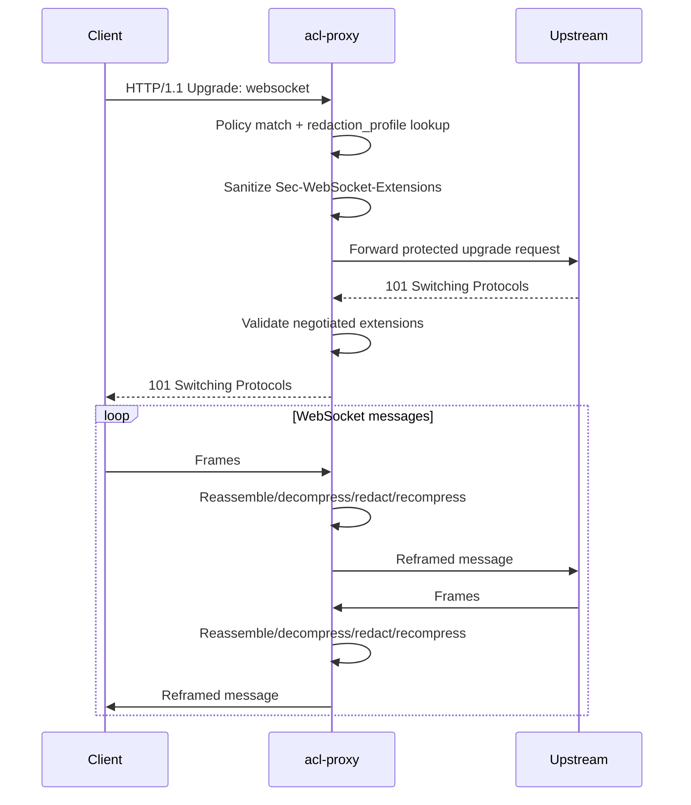

# Native WebSocket Redaction

Superseded by `.specs/design-summary-native-redaction.md`, which replaces the WebSocket-specific config with shared native request redaction profiles.

## Overview

Add native WebSocket message redaction to `acl-proxy` for operator-provided short literal secrets, such as known passwords and API tokens. Today HTTP/1.1 upgrade handshakes are policy-gated, then successful `101 Switching Protocols` responses switch to an opaque byte tunnel in `src/proxy/http.rs`. This feature keeps the existing unprotected tunnel behavior unchanged, but lets a policy rule attach a named redaction profile so upgraded WebSocket traffic is parsed as WebSocket messages, optionally decompressed for `permessage-deflate`, redacted, recompressed when needed, and forwarded with bounded per-message buffering.

## Motivation

Current request-body inspection and plug-in facilities stop at the HTTP request boundary. They can inspect normal HTTP bodies, but after a WebSocket upgrade the proxy relays bytes without seeing frame/message boundaries, so known secrets can pass through long-lived WebSocket sessions unredacted.

## Scope

In scope:

- HTTP/1.1 WebSocket upgrades on the existing HTTP listener, CONNECT MITM inner HTTP/1.1 requests, and transparent HTTPS HTTP/1.1 requests.
- Native config-driven literal redaction without invoking the stdio plug-in hot path.
- Same-length literal replacements in both client-to-upstream and upstream-to-client directions.
- Bounded logical-message hold-back with explicit limits for compressed and decompressed data.
- `permessage-deflate` support by sanitizing extension negotiation, requiring no-context-takeover semantics, decompressing complete messages, applying redaction, recompressing, and reframing.
- README and `acl-proxy.sample.toml` documentation, config validation, policy dump output, logging, and tests.

Out of scope:

- HTTP/2 extended CONNECT / RFC 8441 WebSocket support. README currently documents that this is not implemented.
- Plug-in callbacks per chunk, frame, or message.
- Regex, entropy, heuristic, or external secret discovery.
- Variable-length replacement strings in the first implementation.
- Capturing WebSocket payload contents to disk.
- Compatibility readers or aliases for alternate redaction config shapes.

## Contract

Configuration adds a top-level `redaction` section with named profiles. A policy rule opts in by referencing a profile:

```toml
[redaction.profiles.secrets]
max_frame_bytes = 262144
max_message_bytes = 1048576
allow_permessage_deflate = true
unsupported_extensions = "deny"

[[redaction.profiles.secrets.rules]]
literal = "known-password"
replacement = "**************"
directions = ["client_to_upstream", "upstream_to_client"]
match = "binary"

[[policy.rules]]
action = "allow"
pattern = "wss://example.internal/ws"
allow_upgrades = true
redaction_profile = "secrets"
```

`redaction_profile` is optional on direct rules and rule templates whose `action` is `allow` or `delegate`. It is invalid on `deny` rules because a denied rule never reaches an upgraded tunnel. If unset, `acl-proxy` preserves current behavior: upgrade requests may be allowed or blocked by `allow_upgrades`, and successful upgrades use the existing opaque tunnel.

If set, the referenced profile must exist. Because `redaction` is a top-level config section while `PolicyEngine::from_config` receives only `&PolicyConfig`, the rule-to-profile cross-check lives in `Config::validate_basic`, after TOML/env processing and alongside the existing top-level validators. That validation scans direct rules and ruleset templates, rejects `redaction_profile` on `deny`, and rejects references to missing profiles. It also fails when a profile has no rules, a literal is empty, a replacement differs in byte length from its literal, a direction list is empty or invalid, a message/frame limit is zero, or `unsupported_extensions` is not one of the documented enum values. Unlike `capture.max_body_bytes`, zero is not a skip sentinel here; a zero frame or message limit would make protected redaction unusable, so it is invalid.

Protected rules only support WebSocket upgrades. If a matched rule has `redaction_profile` and the request is an HTTP/1.1 upgrade whose `Upgrade` header is not `websocket`, the proxy denies the request before upstream forwarding.

For protected WebSocket upgrades, request policy evaluation and external auth delegation still run on the handshake request before upstream forwarding. `allow_upgrades = false` still takes precedence and denies before delegate/plugin invocation, matching current behavior. If a `delegate` rule carries `redaction_profile`, the selected profile must be threaded through `run_external_auth_gate_lifecycle` and `run_auth_plugin_gate_lifecycle` into their internal `proxy_allowed_request` calls. This does not change the HTTP webhook or stdio plug-in protocols; the profile is native proxy state applied only after an external allow decision reaches an upstream `101`.

Before returning an upstream `101 Switching Protocols` to the client for a protected rule, `acl-proxy` must inspect the upstream response headers and confirm that negotiated WebSocket extensions are enforceable. If the upstream negotiates unsupported extensions or unsupported `permessage-deflate` parameters, `acl-proxy` returns a normal HTTP error response, such as `502 Bad Gateway`, instead of delivering `101`. This check happens in `proxy_allowed_request` before the response is returned to hyper; it is too late to fail as HTTP once the spawned upgraded relay starts.

After an enforceable upstream `101 Switching Protocols`, `acl-proxy` starts a WebSocket-aware relay instead of `copy_bidirectional`. The implementation uses a focused local frame codec rather than `fastwebsockets` because the first implementation needs direct control over RSV bits and `permessage-deflate` payload handling. It does not use a high-level message API that hides ping/pong/close frames. The downstream side is handled with server role semantics and the upstream side with client role semantics. The relay:

- Parses frames in each direction.
- Forwards interleaved control frames promptly, including while a fragmented data message is being buffered.
- Reassembles full logical data messages for redaction within `max_message_bytes`; protected data frames are not forwarded until their complete logical message has been redacted and reframed.
- Applies profile rules only to configured directions.
- Applies `match = "text"` only to valid UTF-8 text messages, `match = "binary"` to raw bytes, and `match = "both"` to both text and binary messages.
- Replaces every exact literal occurrence with the same-length replacement.
- Reframes messages before forwarding. Frames emitted by the proxy to upstream are masked because the proxy is acting as a WebSocket client; frames emitted by the proxy to downstream clients are unmasked because the proxy is acting as a WebSocket server.

No-early-forward invariant:

- For protected traffic, no byte from a data message may be forwarded before the relay has enough information to guarantee it cannot be part of a configured literal match.
- The first implementation uses full logical-message hold-back, not streaming emission, for data messages. The relay buffers each logical message up to `max_message_bytes`, decompresses if needed, redacts, recompresses if needed, then emits the redacted message.
- A future rolling matcher would have to withhold at least `max_literal_len - 1` trailing bytes per direction and prove by tests that a secret split across frames is never partially forwarded unredacted.

Compression contract:

- If `allow_permessage_deflate = false`, the proxy strips `permessage-deflate` from the client handshake offer for protected rules.
- If `allow_permessage_deflate = true`, the proxy forwards only `permessage-deflate` parameters it supports and forces no-context-takeover semantics for both directions.
- If the upstream response negotiates unsupported WebSocket extensions or unsupported `permessage-deflate` parameters for a protected rule, the proxy fails the request before delivering `101` to the client.
- Within a deflate-negotiated session, each message is handled according to its RSV1 bit. RSV1=1 messages are decompressed, redacted, recompressed, and forwarded with RSV1 set. RSV1=0 data messages are redacted as uncompressed messages and forwarded with RSV1 clear.
- `permessage-deflate` uses raw DEFLATE per RFC 7692 message semantics. With no-context-takeover, the compression window resets for each message. The implementation must apply the per-message empty-block convention, including appending the `0x00 0x00 0xff 0xff` tail for decompression input and removing the tail after compression output as required by the negotiated extension.

Oversize and malformed behavior:

- Malformed WebSocket frames close the upgraded tunnel with close code `1002` (protocol error) when a close frame can still be sent.
- A frame exceeding `max_frame_bytes` closes the tunnel with close code `1009` (message too big).
- A logical message exceeding `max_message_bytes` closes the tunnel with close code `1009`.
- Decompression failure closes the tunnel with close code `1002` when caused by invalid peer data, or `1011` when caused by internal recompression/decompression failure.
- Decompressed size limit violation closes the tunnel with close code `1009`.
- These tunnel-close events are logged with request ID, URL, profile, direction, and reason, but never with payload bytes or literal values.

Logging and capture:

- Existing HTTP request/response capture remains request-scoped. It may capture the WebSocket handshake request/response metadata as it does today, but it does not write WebSocket message payloads.
- Add structured logs for redaction profile activation, extension negotiation outcome, redaction counts, close reasons, and byte/message counters. Logs must not include raw messages, literals, replacements, or unredacted secrets.
- Config validation errors must also avoid echoing `literal` or `replacement` values. Error messages may include profile/rule index and the type of validation failure.

Documentation and release:

- Update README because user-facing docs live there by repository convention.
- Update `acl-proxy.sample.toml` because it is the annotated sample config users copy from. The minimal `config init` output in `write_default_config` does not need to include this optional section.
- Add an `## [Unreleased]` changelog entry during implementation PR preparation.
- Keep the landing as a hot cut for new optional config. No compatibility layer is needed because no previous WebSocket redaction config exists.

## Surface Inventory

| Name | Disposition | Layers | Symmetric peers | Removal twin |
|---|---|---|---|---|
| `[redaction]` | Added | `src/config/mod.rs` parse/validate, `AppState` state, proxy redaction relay, README, `acl-proxy.sample.toml`, config tests | `[capture]`, `[policy.external_auth_profiles]` config sections | None |
| `[redaction.profiles.<name>]` | Added | Config map, validation, runtime profile lookup, README examples | Named external auth profiles in `policy.external_auth_profiles` | None |
| `max_frame_bytes` | Added | Profile config validation, frame parser limit, tests | `capture.max_body_bytes`, plugin body limits | None |
| `max_message_bytes` | Added | Profile config validation, message reassembly/decompression limit, tests | Plugin `max_decompressed_request_body_bytes` | None |
| `allow_permessage_deflate` | Added | Handshake extension sanitizer, relay compression path, integration tests | README WebSocket docs | None |
| `unsupported_extensions` | Added | Config enum, handshake failure/strip behavior, tests | Existing validation enums such as external auth failure mode | None |
| `[[redaction.profiles.<name>.rules]]` | Added | Config parser, redaction engine, tests | Rule arrays under `policy.rules` | None |
| `literal` | Added | Redaction rule validation and matcher | Body-inspection plug-in literal concept, but native config only | None |
| `replacement` | Added | Same-length validation and redaction engine | Plugin `requestBody` mutation is not reused | None |
| `directions` | Added | Direction enum validation and relay direction filter | Header action `direction`, but WebSocket-specific values | None |
| `match` | Added | Match-mode enum validation and redaction engine | Header match predicates are separate and unchanged | None |
| `redaction_profile` | Added | Direct/template policy rules, policy expansion, effective policy dump, proxy rule match handling, tests | `external_auth_profile`, `allow_upgrades` rule fields | None |
| README WebSocket and Plugin Mode sections | Changed | User-facing docs for current opaque tunnel and new protected redaction behavior | Existing README sections around WebSocket traffic and body-aware plug-ins | None |
| `acl-proxy.sample.toml` WebSocket redaction example | Added | Annotated sample config documenting profile and rule reference | Existing sample sections for capture, external auth profiles, and policy rules | None |

## Schema

New config structs in `src/config/mod.rs`:

```rust
pub struct Config {
    // existing fields...
    pub redaction: WebSocketRedactionConfig,
}

pub struct WebSocketRedactionConfig {
    pub profiles: BTreeMap<String, RedactionProfileConfig>,
}

pub struct RedactionProfileConfig {
    pub max_frame_bytes: usize,
    pub max_message_bytes: usize,
    pub allow_permessage_deflate: bool,
    pub unsupported_extensions: RedactionUnsupportedExtensions,
    pub rules: Vec<RedactionRuleConfig>,
}

pub struct RedactionRuleConfig {
    pub literal: String,
    pub replacement: String,
    pub directions: Vec<WebSocketRedactionDirection>,
    #[serde(rename = "match")]
    pub match_mode: RedactionMatch,
}
```

New fields on both `PolicyRuleTemplateConfig` and `PolicyRuleDirectConfig`:

```rust
#[serde(default)]
pub redaction_profile: Option<String>,
```

New effective policy output field:

```rust
pub redaction_profile: Option<String>
```

TOML names:

```toml
[redaction.profiles.<name>]
max_frame_bytes = 262144
max_message_bytes = 1048576
allow_permessage_deflate = true
unsupported_extensions = "deny" # "deny" | "strip"

[[redaction.profiles.<name>.rules]]
literal = "secret"
replacement = "******"
directions = ["client_to_upstream", "upstream_to_client"]
match = "both" # "text" | "binary" | "both"
```

Defaults:

- `max_frame_bytes = 262144`
- `max_message_bytes = 1048576`
- `allow_permessage_deflate = false`
- `unsupported_extensions = "deny"`
- `directions = ["client_to_upstream", "upstream_to_client"]`
- `match = "both"`

Validation is strict. Do not accept alias names, dual shapes, case variants outside serde enum behavior, or legacy fallback fields. Rule-to-profile existence validation is performed in `Config::validate_basic`, not in `PolicyEngine::from_config`, because profiles are top-level config.

## Impact Surface

| File | Responsibility | Existing tests |
|---|---|---|
| `src/config/mod.rs` | Add `redaction` config structs, direct/template rule field, defaults, strict validation, and rule-to-profile cross-validation in `Config::validate_basic`. Existing capture config shows bounded byte config at lines 307-334. Rule config currently carries `allow_upgrades` at lines 501-547 and 574-626. Validation is centralized from `validate_basic` at lines 966-1034. | `tests/config_cli.rs`, config unit tests in `src/config/mod.rs`, policy/config integration tests |
| `src/policy/mod.rs` | Carry `redaction_profile` through expanded, compiled, matched, and effective rule output. `allow_upgrades` is the pattern to follow in matched/effective structs and expansion at lines 51-64, 72-89, 131-147, 205-221, and 299-311. | `tests/policy_cli.rs`, policy unit tests in `src/policy/mod.rs` |
| `src/proxy/http.rs` | Detect protected WebSocket upgrades, sanitize extension headers, forward handshake, validate upstream `101` extension headers before returning the response, and replace opaque `copy_bidirectional` relay at lines 2479-2510 with a WebSocket-aware relay. Thread the selected profile through `proxy_allowed_request`, `run_external_auth_gate_lifecycle`, and `run_auth_plugin_gate_lifecycle` so allow and delegate rules behave consistently. Preserve existing non-upgrade request proxying, `tee_body` capture at lines 2923-2951, and request-body plug-in protocol behavior at lines 1035-1301. | `tests/proxy_http.rs`, especially upgrade/plugin test at lines 809-907 and body compression tests |
| `src/proxy/https_connect.rs` | Pass matched redaction profile through CONNECT MITM inner requests. Preserve `allow_upgrades` denial before forwarding at lines 301-323 and existing policy/delegate behavior. | `tests/proxy_https_connect.rs`, especially lines 429-483 |
| `src/proxy/https_transparent.rs` | Pass matched redaction profile through transparent HTTPS HTTP/1.1 requests. Preserve `allow_upgrades` denial at lines 308-331 and existing HTTP/2 behavior for non-WebSocket requests. | `tests/proxy_https_transparent.rs`, especially WebSocket tunnel test at lines 1102-1226 |
| `src/capture/mod.rs` | Keep WebSocket payloads out of capture; optionally add counters/metadata only if implementation needs an internal type. Existing capture schema is request/response-body oriented at lines 18-93. | `tests/capture.rs`, HTTP/HTTPS capture integration tests |
| `src/auth_plugin.rs` | No protocol changes. Existing request-scoped stdio evaluate flow at lines 135-205 remains handshake-only for delegate rules. | `tests/proxy_http.rs`, `src/auth_plugin.rs` unit tests |
| `Cargo.toml` | Add `rand = "0.8"` for client-role masking keys. Keep using `flate2` for raw DEFLATE helpers. The WebSocket relay uses a focused local frame codec to preserve direct RSV/permessage-deflate control. | Full build and integration tests |
| `README.md` | Update WebSocket docs that currently state post-101 traffic is a bidirectional byte tunnel at lines 233-239. Update plug-in docs that currently state WebSocket traffic is not body-buffered at lines 916-935. | Documentation review plus README examples used by manual validation |
| `acl-proxy.sample.toml` | Add an annotated optional `[redaction.profiles.<name>]` section and a commented policy rule using `redaction_profile`. | Manual docs/sample review |
| `CHANGELOG.md` | Add an Unreleased entry during implementation PR preparation. | Manual review |

## Higher-Level Implementation Steps

1. Add strict config structs, defaults, and validation for `redaction` profiles and per-rule `redaction_profile`; perform missing-profile and action-eligibility checks in `Config::validate_basic`; update policy expansion and effective dump output in the same change so config and inspection stay aligned.
2. Add a focused `proxy::websocket` module that owns handshake extension sanitization, frame-level relay, literal redaction, compression handling, limits, logging, and close behavior.
3. Use an explicit frame codec rather than raw TCP chunk parsing or a high-level message API that hides control frames. Keep control-frame forwarding explicit, while buffering only data messages for redaction.
4. Refactor `proxy_allowed_request`, `run_external_auth_gate_lifecycle`, and `run_auth_plugin_gate_lifecycle` enough to pass the matched redaction profile into the upgrade path while keeping non-upgrade and unprofiled upgrade behavior identical to today's `copy_bidirectional` relay.
5. Implement protected handshake handling: verify `Upgrade: websocket`, sanitize `Sec-WebSocket-Extensions`, forward upstream, validate any accepted extension in the upstream response before returning `101` to the client, substitute an HTTP error for unenforceable extensions, then start the frame-aware relay only after both sides are upgraded.
6. Implement native literal redaction with same-length replacement validation, direction filtering, text/binary match modes, and bounded reassembly of logical messages.
7. Implement `permessage-deflate` support for the supported no-context-takeover subset; strip or deny unsupported extensions according to profile config before the client is upgraded.
8. Add structured logs and make capture behavior explicit: handshake captures remain possible, WebSocket payload captures are intentionally not written.
9. Update README and changelog after tests are in place.
10. Run `cargo fmt`, `cargo clippy`, `cargo test`, and `cargo build --release`.

## Diagrams



## Risks

- WebSocket protocol correctness is the main risk. The relay must handle role-based masking, fragmentation, interleaved ping/pong/close frames, close codes, and half-closed streams correctly.
- `permessage-deflate` is materially more complex than HTTP `Content-Encoding`. Context takeover must be unsupported or forced off for the first implementation; otherwise redaction correctness depends on long-lived compression state. RFC 7692 tail handling must be tested directly.
- The proxy must not send `101` to the client until it knows the upstream extension response is enforceable. After `101`, unsupported compression cannot be reported as a normal HTTP error.
- Bounded buffering protects memory, but it changes behavior for protected sessions with large messages. The close behavior and logs must make this diagnosable without leaking payloads.
- Same-length replacement avoids the first implementation needing broader semantics around message size changes, but operators must provide replacements carefully.
- Literal matching across fragmented messages can miss secrets if implemented per frame, and streaming a partial match can leak a secret prefix. The contract requires logical-message hold-back before forwarding protected data messages.
- Literal secrets are stored in cleartext TOML in the first version. Operators must protect config files and avoid committing real secrets. The implementation must not log literal/replacement values or include them in validation errors. Env interpolation for redaction literals is out of scope for the first version to keep matching deterministic and validation explicit.
- Logging and capture must not leak the configured secrets, replacements, or message bytes.
- Existing unprofiled WebSocket tunnels, egress forwarding chains, and non-upgrade HTTP traffic must not regress.

## Test Strategy

Unit tests:

- Config parses valid profiles and rejects missing profiles, empty literals, unequal replacement lengths, zero limits, invalid directions, invalid match modes, and invalid `unsupported_extensions`.
- Config rejects `redaction_profile` on `deny` rules and accepts it on `allow` and `delegate` rules.
- Policy expansion and `policy dump --format json` include `redaction_profile` for direct and included/template rules.
- Redaction replaces literals across frame/message boundaries and honors direction and match mode.
- `permessage-deflate` negotiation sanitizer strips unsupported extension offers when configured and forces no-context-takeover when compression is allowed.
- Compressed message helper implements RFC 7692 per-message tail handling, decompresses, redacts, recompresses, and enforces decompressed size limits.
- Validation errors for literal/replacement failures include profile and rule index but not the configured values.

Integration tests:

- HTTP listener WebSocket upgrade with a profile redacts client-to-upstream text messages and upstream-to-client messages.
- CONNECT MITM inner WebSocket upgrade with a profile redacts after TLS termination.
- Transparent HTTPS HTTP/1.1 WebSocket upgrade with a profile redacts after TLS termination.
- Unprofiled WebSocket upgrades preserve the current echo/tunnel behavior.
- `allow_upgrades = false` still blocks before delegate/plugin invocation.
- Delegate rules with `redaction_profile` redact after an external HTTP approval or plug-in allow decision, without changing either external auth protocol.
- Protected non-WebSocket upgrades are denied before upstream forwarding.
- Protected compressed WebSocket messages are decompressed, redacted, recompressed, and accepted by the peer.
- In a `permessage-deflate` negotiated session, both RSV1=1 compressed messages and RSV1=0 uncompressed messages are redacted.
- Unsupported compressed extension parameters fail before the client receives `101`.
- Oversize frames/messages close the tunnel with the documented close code and emit safe diagnostic logs.
- A secret split across frames does not leak any unredacted prefix before the full logical message is redacted.
- Ping/pong frames interleaved with a fragmented data message are forwarded promptly.
- Diagnostic logs for close/error/redaction events contain request ID, URL, profile, direction, counters, and reason, but not payload bytes, literals, or replacements.
- Egress forwarding chains still preserve unprofiled upgrades and apply redaction only at the proxy whose matched rule has the profile.

Required commands before merge:

```bash
cargo fmt
cargo clippy
cargo test
cargo build --release
```

## Open Assumptions

- Operators can provide exact literal secrets and same-length replacements for the first version.
- It is acceptable for protected profiles to alter WebSocket extension negotiation, including stripping unsupported extensions or forcing no-context-takeover.
- WebSocket payload capture is not required for this feature; safe structured logs and handshake capture metadata are sufficient.
- HTTP/2 RFC 8441 remains out of scope until the repository adds HTTP/2 WebSocket support generally.
- A focused local WebSocket frame codec is acceptable for this first implementation because direct RSV/permessage-deflate control is required; protocol coverage must compensate with frame, fragmentation, masking, compression, and close-code tests.
