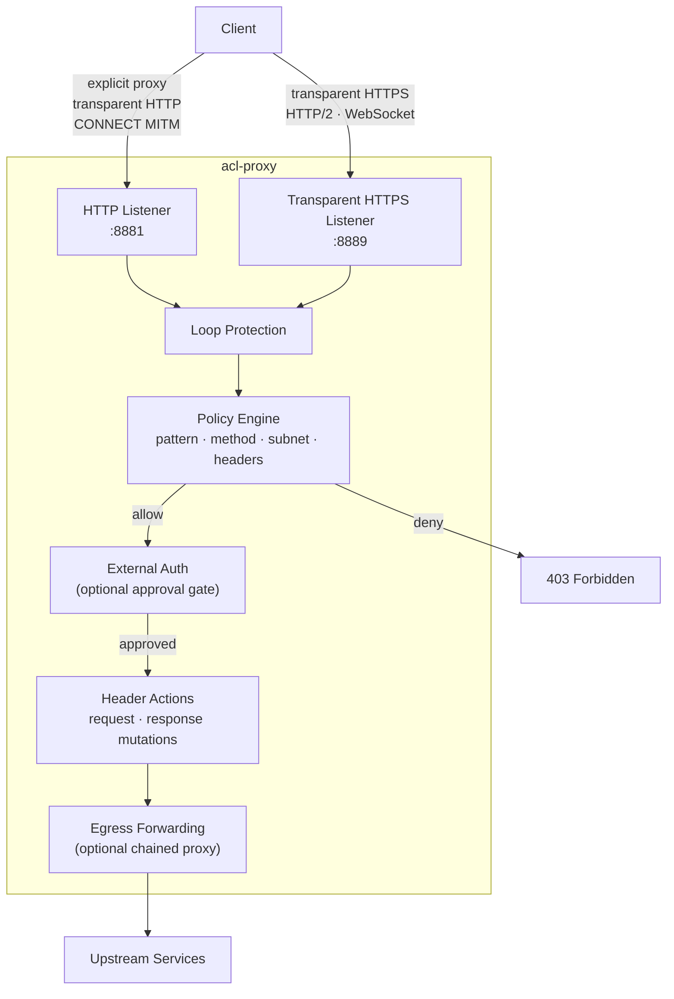
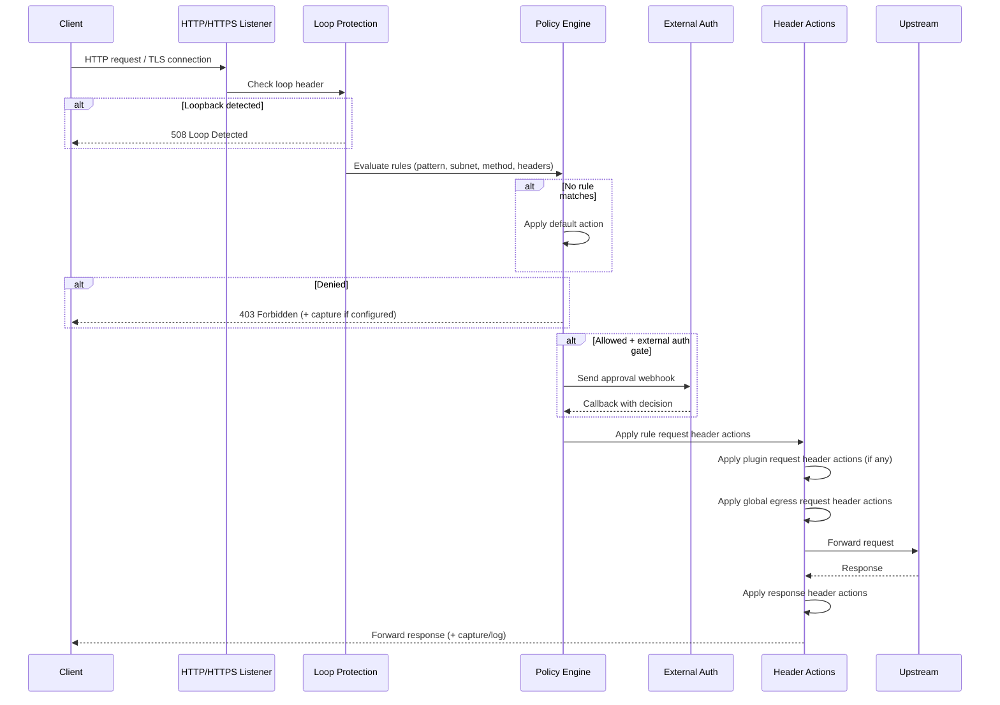
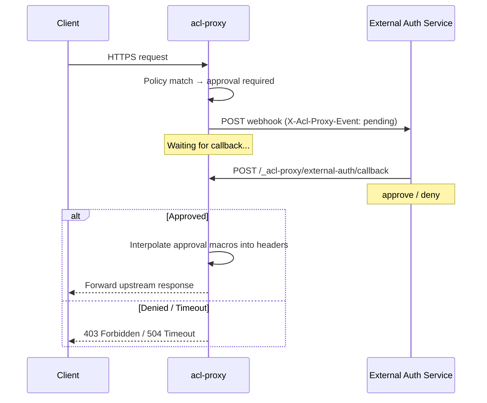
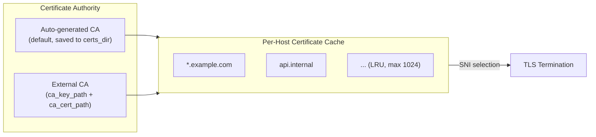

# acl-proxy

A Rust-based ACL-aware HTTP/HTTPS proxy with a TOML configuration file and a flexible URL policy engine. Evaluate every request against ordered rules matching on URL patterns, HTTP methods, client subnets, and headers — then allow, deny, or gate behind an external approval workflow.

## Table of Contents

- [How It Works](#how-it-works)
- [Quick Start](#quick-start)
- [Proxy Modes](#proxy-modes)
- [Policy Engine](#policy-engine)
- [Configuration Reference](#configuration-reference)
- [External Auth](#external-auth)
- [Operations](#operations)
- [TLS & Certificates](#tls--certificates)
- [Logging & Capture](#logging--capture)
- [CLI Reference](#cli-reference)
- [Troubleshooting](#troubleshooting)
- [Project Structure](#project-structure)
- [Development](#development)
- [Demos](#demos)
- [License](#license)

## How It Works

acl-proxy sits between clients and upstream services, intercepting HTTP and HTTPS traffic across four request paths. Every request is evaluated by the same policy engine regardless of how it enters the proxy.



**Policy evaluation order** for each rule: pattern → subnets → methods → `headers_absent` → `headers_match`. First match wins; if nothing matches, `policy.default` applies.

## Quick Start

### Prerequisites

- **Rust toolchain** (2021 edition) — [install](https://rustup.rs/)

### 1. Build

```bash
git clone https://github.com/kcosr/acl-proxy.git
cd acl-proxy
cargo build --release
```

### 2. Create a Configuration

Generate a minimal config:

```bash
acl-proxy config init config/acl-proxy.toml
```

Or copy the sample and edit it:

```bash
mkdir -p config
cp acl-proxy.sample.toml config/acl-proxy.toml
```

The generated minimal config defaults to deny-all and disables capture.

### 3. Validate & Run

```bash
# Validate configuration
acl-proxy config validate --config config/acl-proxy.toml

# Start the proxy
acl-proxy --config config/acl-proxy.toml
```

The proxy starts:
- The HTTP listener on `proxy.bind_address:proxy.http_port` (explicit proxy and transparent HTTP interception).
- The transparent HTTPS listener on `proxy.https_bind_address:proxy.https_port` if `https_port` is non-zero.

### 4. Send Traffic

```bash
# Check readiness
curl http://127.0.0.1:8881/_acl-proxy/ready

# HTTP explicit proxy
curl -x http://127.0.0.1:8881 http://example.com/

# Transparent HTTP interception (local testing)
curl http://example.com/path \
  --connect-to example.com:80:127.0.0.1:8881

# HTTPS proxy (CONNECT MITM)
curl -x http://127.0.0.1:8881 https://example.com/ \
  --proxy-cacert certs/ca-cert.pem

# Transparent HTTPS listener
curl https://upstream.internal/resource \
  --connect-to upstream.internal:443:127.0.0.1:8889 \
  --cacert certs/ca-cert.pem
```

Or run directly with Cargo during development:

```bash
cargo run -- --config config/acl-proxy.toml
```

## Proxy Modes

acl-proxy supports four request paths. All modes apply the same policy engine, logging, capture, and header actions.

| Mode | Listener | Protocol | Description |
|------|----------|----------|-------------|
| **Explicit HTTP proxy** | `http_port` | HTTP/1.1 | Absolute-form requests via `curl -x` |
| **Transparent HTTP** | `http_port` | HTTP/1.1 | Origin-form requests with `Host` header (e.g., iptables `REDIRECT`/DNAT from port 80) |
| **CONNECT MITM** | `http_port` | HTTPS | TLS terminated inside tunnel with per-host CA-signed certs; inner requests processed as HTTP/1.1 |
| **Transparent HTTPS** | `https_port` | HTTPS | Direct TLS termination; HTTP/1.1 and HTTP/2 via ALPN negotiation |

### Request Lifecycle



### Transparent HTTP Interception

In transparent HTTP mode, upstream target selection is based on the inbound `Host` header (`:80` when no port is present). Use restrictive policy rules for the destinations you intend to allow.

### HTTPS CONNECT (MITM)

- Policy is evaluated on each decrypted request; the CONNECT request itself is only used to establish the tunnel.
- Request-header predicates (`headers_absent`, `headers_match`) apply only to decrypted inner requests, not to the outer CONNECT establishment request.
- Loop protection runs on both the CONNECT request and the inner requests.
- The outer CONNECT handshake remains local to the first proxy hop. If egress forwarding is enabled, only the decrypted inner HTTPS requests use the egress destination.
- Clients must trust the proxy CA (`certs/ca-cert.pem` by default).

### Transparent HTTPS

- Set `https_port = 0` to disable this listener.
- URL construction is based on the Host header or the request URI authority.
- Inbound HTTP/2 is supported via ALPN negotiation.
- If the Host header is missing or invalid, the proxy returns `400 Bad Request`.

### WebSocket and Upgrade Traffic

- HTTP/1.1 upgrade handshakes are proxied on all HTTP/1.1 request paths (HTTP listener, CONNECT inner, transparent HTTPS when HTTP/1.1 is negotiated).
- After a `101 Switching Protocols` response, acl-proxy switches to a bidirectional byte tunnel between client and upstream.
- HTTP/2 extended CONNECT / RFC 8441 is not currently implemented.

### Upstream HTTP Version

By default, acl-proxy uses HTTP/1.1 for upstream connections, even when clients speak HTTP/2 to the proxy. To enable upstream HTTP/2:

```toml
[tls]
enable_http2_upstream = true
```

When enabled, ALPN is used per origin; the proxy will use HTTP/2 where supported and fall back to HTTP/1.1 otherwise.

### Chained Proxy Deployments

When `[proxy.egress.default]` is configured, allowed proxied requests from all modes are sent to the configured egress host:port instead of the original target.

- The forwarding leg remains cleartext TCP — deploy on a trusted/local network path.
- Forwarding is protocol-aware: HTTP/2 requests use h2c, HTTP/1.1 (including WebSocket) stays HTTP/1.1.
- The forwarded request keeps the original target URI and `Host` header, so the outer proxy still evaluates policy against the real target.
- The recommended egress target is the outer proxy's HTTP listener (`proxy.http_port`), not the transparent HTTPS listener.

**Loop prevention**: If both hops use loop protection, either configure different `loop_protection.header_name` values per hop, or disable outbound injection on the inner proxy with `loop_protection.add_header = false`.

**Timeout guidance**: Set the inner proxy timeout high enough to cover the outer proxy timeout plus its upstream work.

## Policy Engine

The policy engine evaluates each request against an ordered list of rules and returns the first match. If no rule matches, `policy.default` applies. Invalid or unparseable URLs are always denied.

### Rule Evaluation Order

1. Normalize the request URL.
2. Normalize the client IP (if present).
3. Normalize the HTTP method (if present).
4. Evaluate rules in the order they appear:
   - Pattern match (if set)
   - Subnet match (if set)
   - Method match (if set)
   - `headers_absent` match (if set)
   - `headers_match` match (if set)
5. First match wins.
6. If nothing matches, apply `policy.default`.

All predicates use AND semantics — a rule matches only when every predicate passes.

### URL Normalization

Before applying rules, the engine normalizes input URLs to:

```
protocol + "//" + host[:port] + path + optional "?query"
```

- The scheme is preserved (`http:` or `https:`).
- The host includes a port only when it was explicit in the URL. No default port is added.
- The path defaults to `/` when empty.
- Query strings are preserved; fragments are ignored.
- IPv6 hostnames use standard bracket notation (e.g., `https://[::1]:8443/path`).

### Pattern Syntax

Patterns are matched case-insensitively against normalized URLs.

- **Scheme is optional**: `https://example.com/**` and `example.com/**` both match `https` and `http`.
- **Wildcards**:
  - `*` matches any sequence of characters except `/`.
  - `**` matches any sequence of characters including `/`.
- **Host-only patterns**: `https://example.com` matches `https://example.com` and `https://example.com/` but not deeper paths.

Examples:

```
https://example.com/api/**        # any path under /api
https://example.com/api/*/v1      # one segment between /api and /v1
example.com                       # host-only, any scheme
```

### Methods

Methods are specified as a string or list of strings and normalized to uppercase:

```toml
methods = "POST"
methods = ["GET", "HEAD"]
```

Rules without `methods` have no method restriction.

### Subnets

Client IP subnets are specified as IPv4 or IPv6 CIDR ranges:

```toml
subnets = ["10.0.0.0/8", "192.168.0.0/16", "::1/128"]
```

Client IP normalization:
- Strips interface suffixes after `%` (e.g., `fe80::1%eth0` → `fe80::1`).
- Maps `::ffff:x.y.z.w` to `x.y.z.w`.
- Maps `::1` to `127.0.0.1`.

### Header-Absence Predicate

Rules can match on missing inbound request headers:

```toml
[[policy.rules]]
action = "deny"
pattern = "**"
headers_absent = ["x-workload-id"]
description = "Deny requests missing workload identity"
```

- Matches when any listed request header is missing.
- Header-name lookup is case-insensitive.
- A header present with an empty value still counts as present.
- When all listed headers are present, the rule falls through to the next rule.
- On HTTPS over CONNECT, applies to the decrypted inner request, not the outer CONNECT.

### Header-Value Predicate

Rules can require exact inbound request-header values:

```toml
[[policy.rules]]
action = "allow"
pattern = "https://api.internal.example.com/**"
headers_match = { "x-workload-id" = ["worker-123", "worker-456"], "x-tenant-id" = "tenant-a" }
description = "Allow trusted workload identities"
```

- Across header keys: `AND` semantics.
- Within one key's values: `OR` semantics.
- Header names are case-insensitive.
- Value matching is exact and case-sensitive — no trimming, no comma splitting.
- Repeated inbound header values are supported; any exact match satisfies that key.
- Empty configured values are rejected during config validation.
- When both `headers_absent` and `headers_match` are configured, both predicates must pass.

### Multiple URL Patterns

Use `patterns = [...]` when several URL patterns should share identical rule attributes:

```toml
[[policy.rules]]
action = "allow"
patterns = [
  "https://developers.openai.com/**",
  "https://github.com/openai/**",
  "https://raw.githubusercontent.com/openai/**",
  "https://api.github.com/repos/openai/**",
]
methods = ["GET"]
description = "OpenAI docs and repositories"
```

- Use `pattern = "..."` for one URL pattern and `patterns = ["...", "..."]` for several.
- `pattern` and `patterns` are mutually exclusive.
- `patterns` must include at least one non-empty pattern; entries are trimmed before expansion.
- A multi-pattern rule expands into one effective rule per pattern, preserving configured pattern order and first-match-wins behavior.
- `policy dump` shows the expanded effective rules with singular `pattern` values.
- Policy decision logs report the specific matched effective `rule_pattern`, not the original `patterns` array.
- `rule_id` is rejected on multi-pattern rules because copied IDs would not be unique.

### Macros and Rulesets

Macros are named placeholders expanded before patterns are compiled:

```toml
[policy.macros]
repo = ["team/service-a", "team/service-b"]

[[policy.rulesets.git_repo]]
action = "allow"
pattern = "https://git.internal/{repo}.git/**"
description = "Git HTTP(S) for {repo}"
methods = ["GET", "POST"]
```

Ruleset templates can also use `patterns = [...]`; include expansion emits one concrete rule for each template pattern.

Include rules expand a ruleset into concrete rules:

```toml
[[policy.rules]]
include = "git_repo"
add_url_enc_variants = true
methods = ["GET", "POST"]           # overrides template methods
subnets = ["10.0.0.0/8"]           # overrides template subnets
```

- `with` provides macro overrides specific to this include.
- `add_url_enc_variants = true` generates both raw and URL-encoded variants for all placeholders.
- `methods` and `subnets` on the include override the template values; when omitted, template values are used.
- `headers_absent` and `headers_match` are inherited from the template, not overridden.
- Missing macros required by a ruleset cause validation failure.

### Header Actions

Rules can modify headers on matching requests and responses. Actions do not participate in rule matching — they run only after a rule matches.

```toml
[[policy.rules]]
action = "allow"
pattern = "https://github.com/**"

  [[policy.rules.header_actions]]
  direction = "request"          # request | response | both
  action    = "set"              # set | add | remove | replace_substring
  name      = "user-agent"
  value     = "acl-proxy/1.0"
  when      = "always"           # always | if_present | if_absent

  [[policy.rules.header_actions]]
  direction = "response"
  action    = "replace_substring"
  name      = "x-upstream-tag"
  search    = "old"
  replace   = "new"
```

| Action | Description |
|--------|-------------|
| `set` | Replace all existing values with the configured value(s) |
| `add` | Append new values without removing existing ones |
| `remove` | Delete the header entirely |
| `replace_substring` | Find and replace within each current value |

**`when` conditions**: `always` (default), `if_present`, `if_absent` — evaluated against the original header state before any actions for that direction run.

**`value` / `values`**: Exactly one must be provided for `set`/`add`. Values must be valid HTTP header values.

**Environment variable interpolation**: Exact whole-string `${NAME}` placeholders in `value`/`values` resolve once at config load/reload time. `NAME` must match `[A-Za-z_][A-Za-z0-9_]*`. Mixed strings like `Bearer ${TOKEN}` are rejected. Missing env vars fail validation, startup, and reload.

**Approval macros**: `{{name}}` placeholders are a separate feature for external auth workflows — they are not resolved at config load time. See [External Auth](#external-auth).

### Global Egress Request Header Actions

A global request-only layer under `[[proxy.egress.request_header_actions]]` applies the same outbound mutations to every forwarded request after matched-rule/plugin request actions.

```toml
[[proxy.egress.request_header_actions]]
action = "set"
name = "x-egress-tag"
value = "edge-a"
when = "always"
```

Ordering for outbound requests:
1. Evaluate policy and match the first rule.
2. Apply matched-rule request header actions.
3. Apply plugin request header actions (when present).
4. Apply global egress request header actions.
5. Send upstream.

Global egress actions never affect rule matching. Their `when` conditions are evaluated against header presence at the start of the global layer (after rule/plugin actions). Global response-header actions are not supported — only request-direction actions are available in this layer.

### Debugging Policies

Use the policy inspection CLI to see the fully expanded rule set:

```bash
acl-proxy policy dump --config config/acl-proxy.toml
acl-proxy policy dump --format table
acl-proxy policy dump --format json
```

`policy dump` defaults to table output on a TTY and JSON otherwise. It includes `headers_match` values — treat output as sensitive when those values represent credentials.
When a rule uses `patterns`, the dump shows one effective row/object per expanded pattern with a singular `pattern` field.

## Configuration Reference

### Config File Resolution

The proxy resolves the config path in this order:

1. `--config <path>` CLI argument
2. `ACL_PROXY_CONFIG` environment variable
3. `config/acl-proxy.toml` (relative to the current working directory)

If the default path is missing, the CLI suggests running `acl-proxy config init`.

### Environment Variable Overrides

After parsing the config file, these overrides are applied:

| Variable | Config Field | Default |
|----------|-------------|---------|
| `PROXY_PORT` | `proxy.http_port` (valid `u16`) | `8881` |
| `PROXY_HOST` | `proxy.bind_address` | `0.0.0.0` |
| `LOG_LEVEL` | `logging.level` | `info` |

### Top-Level Sections

```toml
schema_version = "1"          # required; only "1" is supported

[proxy]
[proxy.egress]
[[proxy.egress.request_header_actions]]
[logging]
[capture]
[loop_protection]
[certificates]
[tls]
[external_auth]
[policy]
```

All sections except `schema_version` and `[policy].default` are optional with sensible defaults.

### `[proxy]` — Listeners and Ports

```toml
[proxy]
bind_address = "0.0.0.0"           # IP for the HTTP listener
http_port = 8881                    # port for HTTP listener (0 = ephemeral)
https_bind_address = "0.0.0.0"     # IP for the transparent HTTPS listener
https_port = 8889                   # port for HTTPS listener (0 = disabled)
request_timeout_ms = 30000          # upstream timeout; 0 = disabled
internal_base_path = "/_acl-proxy"  # base path for internal endpoints
```

- `internal_base_path` must start with `/` and must not end with `/` (except root `/`). Internal endpoints are only matched for origin-form (direct) requests, not proxy-style absolute-form requests.

### `[proxy.egress.default]` — Optional Forwarding Destination

```toml
[proxy.egress.default]
host = "172.17.0.1"                # DNS hostname or IP; IPv6 bare (::1) or bracketed ([::1])
port = 8889                         # TCP port (1–65535)
```

When present, allowed request-forwarding paths use this egress destination as the outbound TCP dial target while policy matching, logging, and the forwarded `Host` header remain bound to the original request target. When absent, the proxy connects directly to each request's original target.

### `[logging]` — Logging

```toml
[logging]
level = "info"                      # trace | debug | info | warn | error
directory = "logs"                  # omit for console-only
max_bytes = 104857600               # rotation threshold (bytes)
max_files = 5                       # rotated files to keep
console = true                      # also write to stdout
```

- When `directory` is set, logs go to `{directory}/acl-proxy.log` and rotate by size.
- Log writing is non-blocking; when the internal buffer fills, entries are dropped to avoid stalling requests.
- Transport logs on `acl_proxy::transport` (debug level) include per-request ingress, egress-attempt, egress, and completion events.

### `[logging.policy_decisions]` — Policy Decision Logging

```toml
[logging.policy_decisions]
log_allows = false                  # log allowed decisions
log_denies = true                   # log denied decisions
level_allows = "info"               # log level for allows
level_denies = "warn"               # log level for denies
```

Policy decision events are emitted to the `acl_proxy::policy` target with structured fields: `request_id`, `allowed`, `url`, `method`, `client_ip`, `rule_action`, `rule_pattern`, `rule_description`.

### `[capture]` — Request/Response Capture

```toml
[capture]
allowed_request = false             # capture allowed request records
allowed_response = false            # capture allowed response records
denied_request = false              # capture denied request records
denied_response = false             # capture denied response records
directory = "logs-capture"          # base directory for capture files
filename = "{requestId}-{suffix}.json"   # template ({requestId}, {kind}, {suffix})
max_body_bytes = 65536              # max body bytes to serialize (0 = skip body)
```

Capture happens for:
- Allowed requests/responses when the corresponding flags are enabled.
- Denied requests/responses for policy or loop protection when denied flags are enabled.
- Upstream failures (502/504) as allowed traffic when capture is enabled.

`body.length` always records the full logical body length even when `body.data` is truncated.

#### Capture Record Format

Each JSON file contains a single object:

| Field | Type | Description |
|-------|------|-------------|
| `timestamp` | string | RFC 3339 timestamp |
| `requestId` | string | Internal request ID |
| `kind` | string | `"request"` or `"response"` |
| `decision` | string | `"allow"` or `"deny"` |
| `mode` | string | `"http_proxy"`, `"https_connect"`, or `"https_transparent"` |
| `url` | string | Normalized URL (no fragment) |
| `method` | string | HTTP method |
| `httpVersion` | string | e.g., `"1.1"`, `"2"` |
| `statusCode` | number | HTTP status code (responses only) |
| `statusMessage` | string | Status message (responses only) |
| `client` | object | `address` (string), `port` (number) |
| `target` | object | Upstream `address` and `port` (when available) |
| `headers` | object | Lowercase keys; values are string or string array |
| `body` | object | `encoding` (`"base64"`), `length` (full), `data` (base64), `contentType` |

#### Extract Captured Bodies

```bash
acl-proxy-extract-capture-body logs-capture/req-123-res.json > body.bin
```

Reports errors for invalid JSON, missing bodies, or unsupported encodings.

### `[loop_protection]` — Loop Detection

```toml
[loop_protection]
enabled = true                      # enable loop detection on all paths
add_header = true                   # inject header into outbound requests
header_name = "x-acl-proxy-request-id"  # header name for detection/injection
```

When an inbound request contains the loop header and loop protection is enabled, the proxy responds with:
- Status: `508 Loop Detected`
- Body: `{ "error": "LoopDetected", "message": "Proxy loop detected via loop protection header" }`

Loop detection runs on: HTTP listener requests (explicit + transparent), CONNECT requests, decrypted CONNECT inner requests, and transparent HTTPS requests.

### `[certificates]` — CA and Per-Host Certificates

```toml
[certificates]
certs_dir = "certs"                 # base directory for certificate material
ca_key_path = "/path/to/ca-key.pem"   # optional external CA key
ca_cert_path = "/path/to/ca-cert.pem" # optional external CA cert
max_cached_certs = 1024             # LRU cache size (min 1)
```

- When both `ca_key_path` and `ca_cert_path` are absent, the proxy auto-generates a CA in `certs_dir` and reuses it if valid files already exist.
- When both are provided, the proxy uses them as-is; invalid/unreadable files cause a startup error.
- When only one is provided, validation fails — both must be set or both omitted.
- Per-host certificates are generated on demand, cached in memory (LRU), and also written to `certs_dir/dynamic/` as `<host>.crt`, `<host>.key`, and `<host>-chain.crt` for debugging transparency. On-disk files are not reloaded on startup.

### `[tls]` — Upstream TLS Behavior

```toml
[tls]
verify_upstream = true              # verify upstream HTTPS certificates
enable_http2_upstream = false       # HTTP/1.1-only by default
```

- `verify_upstream = false` accepts all upstream certificates regardless of host or issuer. Use only in controlled test environments.
- `enable_http2_upstream = true` lets ALPN negotiation choose HTTP/2 per origin; the proxy falls back to HTTP/1.1 when the origin doesn't advertise `h2`.

These settings affect only outbound TLS from proxy to upstream. Incoming TLS is always terminated using the proxy's CA.

### `[external_auth]` — External Auth Settings

```toml
[external_auth]
callback_url = "https://proxy.example.com/_acl-proxy/external-auth/callback"
```

`callback_url` must be an absolute URL with a host. Empty or relative values are rejected. This value is included in external auth webhooks as `callbackUrl`.

### `[policy]` — Policy Engine

```toml
[policy]
default = "deny"                    # "allow" or "deny" (case-insensitive)
```

See [Policy Engine](#policy-engine) for full details on rules, macros, rulesets, and header actions.

#### Direct Rule Fields

```toml
[[policy.rules]]
action = "allow"                    # required: "allow" | "deny"
pattern = "https://example.com/**"  # optional: URL pattern
# patterns = ["https://a/**"]       # optional alternative: multiple URL patterns
description = "Example rule"        # optional
methods = ["GET", "POST"]           # optional: HTTP methods
subnets = ["10.0.0.0/8"]           # optional: client IP CIDRs
headers_absent = ["x-id"]          # optional: missing-header check
headers_match = { "x-id" = "v1" }  # optional: exact header match
request_timeout_ms = 5000          # optional: override upstream timeout
rule_id = "stable-id"             # optional: stable ID for webhooks
external_auth_profile = "name"     # optional: approval gate (allow rules only)
```

At least one of `pattern`, `patterns`, `methods`, `subnets`, `headers_absent`, or `headers_match` must be present.

#### Include Rule Fields

```toml
[[policy.rules]]
include = "ruleset_name"            # required: reference a ruleset
with = { repo = "override" }       # optional: macro overrides
add_url_enc_variants = true         # optional: URL-encode placeholders
methods = ["GET"]                   # optional: override template methods
subnets = ["10.0.0.0/8"]           # optional: override template subnets
request_timeout_ms = 5000          # optional: override template timeout
```

#### Approval Macro Descriptors

```toml
[policy.approval_macros]
github_token = { label = "GitHub token", required = true, secret = true }
reason       = { label = "Approval reason", required = false, secret = false }
```

- `label`: Human-friendly label for approver UIs (defaults to macro name).
- `required`: Whether the approver must supply a non-empty value (default `true`).
- `secret`: Hint to mask input and avoid logging (default `false`).

#### External Auth Profile Fields

```toml
[policy.external_auth_profiles.github_mfa]
type = "http"                       # "http" (default) | "plugin"
webhook_url = "https://..."         # required for type = "http"
timeout_ms = 5000                   # required: approval/plugin timeout
webhook_timeout_ms = 1000           # optional: webhook delivery timeout
on_webhook_failure = "error"        # "deny" | "error" | "timeout"

[policy.external_auth_profiles.url_allow]
type = "plugin"
command = "/usr/local/bin/url-allow" # required for type = "plugin"
args = ["--config", "/etc/url-allow.json"]
timeout_ms = 1000
restart_delay_ms = 10000            # delay before restarting crashed plugin
include_headers = ["x-*"]           # header name globs to forward
env = { KEY = "value" }             # env vars for the plugin process
```

### Minimal Configuration

```toml
schema_version = "1"

[proxy]
bind_address = "0.0.0.0"
http_port = 8881
https_bind_address = "0.0.0.0"
https_port = 8889
request_timeout_ms = 30000
internal_base_path = "/_acl-proxy"

[logging]
level = "info"

[policy]
default = "deny"
```

The repository includes [`acl-proxy.sample.toml`](acl-proxy.sample.toml) as a comprehensive example covering all options.

### Validation

The config loader performs validation beyond basic TOML parsing:

- `schema_version` must equal `"1"`.
- Direct rules must have at least one of `pattern`, `patterns`, `methods`, `subnets`, `headers_absent`, or `headers_match`.
- Direct rules and ruleset templates must not define both `pattern` and `patterns`.
- `patterns` must include at least one non-empty pattern.
- Include rules must reference an existing ruleset.
- Macro placeholders (`{name}`) must resolve from `policy.macros` or `with` overrides.
- `ca_key_path` and `ca_cert_path` must be both set or both omitted.
- `loop_protection.header_name` must be a valid HTTP header name.
- `${NAME}` env placeholders must resolve at validation/startup/reload time. Existing literal `${...}` strings in `set`/`add` header-action values are reserved syntax and must be migrated.
- `external_auth_profile` on `action = "deny"` rules is rejected — approval-required deny rules are not allowed.

On validation failure, `config validate` and startup report a human-readable error and abort, leaving any previously running instance (in the case of reload) unchanged.

## External Auth

External auth turns `allow` rules into approval-required gates. When a matching request hits an approval-gated rule, acl-proxy pauses the request, sends a webhook to an external service, and waits for a callback decision.



### Webhook Format

When a rule with `external_auth_profile` matches, the proxy POSTs a webhook:

- **URL**: `policy.external_auth_profiles.<name>.webhook_url`
- **Header**: `X-Acl-Proxy-Event: pending`
- **Payload fields**: `requestId`, `profile`, `ruleIndex`, optional `ruleId`, `url`, `method`, `clientIp`, `status: "pending"`, `terminal: false`, `timestamp` (RFC3339), `elapsedMs`, `eventId`, `callbackUrl` (when configured), and `macros` (approval macro descriptors).

### Terminal Status Webhook

For lifecycle events (webhook failure, timeout, error, cancellation), the proxy emits a best-effort status webhook:

- **Header**: `X-Acl-Proxy-Event: status`
- **Fields**: `status` (`webhook_failed` | `timed_out` | `error` | `cancelled`), `terminal: true`, `reason`, optional `failureKind` and `httpStatus`.
- At most one terminal event per `requestId`.
- Status webhooks are **telemetry only** — delivery failures never affect the allow/deny decision.

### Callback Endpoint

```
POST /{internal_base_path}/external-auth/callback
Content-Type: application/json

{
  "requestId": "req-...",
  "decision": "allow" | "deny",
  "macros": {
    "github_token": "ghp_...",
    "reason": "Approving for test"
  }
}
```

| Response | Condition |
|----------|-----------|
| `200 OK` with `{ "status": "ok" }` | Success |
| `404 Not Found` | Unknown or already completed `requestId` |
| `400 Bad Request` | Invalid body or missing required macros |

**Macro validation**: Required macros must be present and non-empty. Values must not contain control characters (ASCII < 0x20 or DEL). Optional macros may be omitted or empty.

### Plugin Mode (type = "plugin")

Stdio-based synchronous auth. The proxy spawns a long-running plugin process and sends JSON requests over stdin, waiting for allow/deny JSON responses from stdout (newline-delimited). On allow, the proxy applies rule header actions first, plugin header actions second, and global egress request actions third. Plugins can also return response header actions. See [`docs/design/auth-plugins-design.md`](docs/design/auth-plugins-design.md) for the full protocol specification.

### Failure Handling

`on_webhook_failure` controls behavior when the initial webhook fails:

| Mode | Response |
|------|----------|
| `deny` | 403 Forbidden |
| `error` | 503 Service Unavailable (default) |
| `timeout` | 504 Gateway Timeout |

### Security Note

The callback endpoint does not authenticate requests. Restrict access to `/{internal_base_path}/external-auth/callback` using network policy or firewall rules.

## Operations

### Startup

`acl-proxy` validates configuration at startup. If logging initialization fails, the proxy still starts but reports the error to stderr.

### Readiness Probe

```bash
curl http://127.0.0.1:8881/_acl-proxy/ready
# → {"status": "ready"}
```

The endpoint is internal to the proxy and does not require a policy match. Only GET is supported (returns 405 for other methods).

### Config Reload

Send `SIGHUP` to reload configuration without downtime:

```bash
kill -HUP $(pidof acl-proxy)
```

- A new `AppState` is built and swapped atomically via `ArcSwap`.
- New connections use the new config immediately. In-flight requests complete with the previous config.
- If reload fails, the previous state remains active.
- `${NAME}` env placeholders are resolved again during reload. Changing a required env var takes effect on the next successful reload; removing one causes the reload to fail.

### Graceful Shutdown

`SIGTERM` or `Ctrl+C` stops accepting new connections. In-flight requests continue using existing state until they finish.

### Loop Protection

Loop protection rejects any request containing the configured header (default `x-acl-proxy-request-id`) with:
- Status: `508 Loop Detected`
- Body: `{ "error": "LoopDetected", "message": "Proxy loop detected via loop protection header" }`

Capture logging for loop-detected requests follows the `[capture]` flags for denied traffic.

### Request Timeouts

- `proxy.request_timeout_ms` sets the default upstream timeout (30s).
- Rules can override with `request_timeout_ms`.
- `0` disables the timeout.
- When the timeout expires, the proxy responds with `504 Gateway Timeout`.

### Egress Forwarding

```toml
[proxy.egress.default]
host = "172.17.0.1"
port = 8889
```

Operational details:
- The inter-proxy forwarding leg remains cleartext TCP — deploy on trusted/local network.
- Request bodies and sensitive headers injected by inner-proxy header actions travel in cleartext on that hop.
- HTTP/2 requests do not silently downgrade; if h2c cannot be established, the request fails.
- Exempt the outer proxy's listener from any iptables redirect rules to avoid loop-back.
- A valid config reload atomically swaps in the updated egress destination.

## TLS & Certificates

acl-proxy acts as a TLS man-in-the-middle for CONNECT and transparent HTTPS modes, issuing per-host certificates signed by a local CA.



### CA Behavior

- **Default CA** (no explicit paths): Auto-generated at `certs/ca-key.pem` and `certs/ca-cert.pem`. If valid files exist, they are reused; otherwise a new CA is generated and written.
- **External CA** (`ca_key_path` + `ca_cert_path`): Used as-is. Missing/invalid files cause startup/reload failure. Both must be set or both omitted.

### Per-Host Certificates

Generated on demand for each host (SNI or CONNECT target). Cached in memory with LRU eviction (configurable `max_cached_certs`, default 1024). Also written to disk for debugging:
- `certs/dynamic/<host>.crt` — leaf certificate
- `certs/dynamic/<host>.key` — private key
- `certs/dynamic/<host>-chain.crt` — leaf + CA chain

On-disk files are not reloaded on startup — the proxy regenerates from the CA as needed.

### Client Trust

Clients must trust the proxy CA:
- **CONNECT MITM**: `--proxy-cacert certs/ca-cert.pem` or import the CA system-wide.
- **Transparent HTTPS**: `--cacert certs/ca-cert.pem` or import the CA system-wide.
- Plain HTTP proxy traffic does not require CA trust.

### Upstream TLS Verification

Outgoing TLS from the proxy to upstream is verified against system root certificates by default. Set `tls.verify_upstream = false` only in controlled test environments.

## Logging & Capture

### Structured Logging

- Configurable level (`trace` through `error`), with env override via `LOG_LEVEL`.
- Optional file rotation by size (default 100 MB, 5 files) when `logging.directory` is set.
- Non-blocking — entries are dropped when the buffer is full (never stalls requests).
- Console output controlled by `logging.console` (default `true`).

### Policy Decision Logging

Separate control for allow vs. deny decisions with configurable log levels. Events are emitted to the `acl_proxy::policy` target with structured fields: `request_id`, `allowed`, `url`, `method`, `client_ip`, and rule metadata.

### Request/Response Capture

JSON capture files with request metadata, headers, and base64-encoded bodies. Enable independently for allowed/denied requests/responses. Body size capped at `capture.max_body_bytes` (default 64 KiB); full logical length always recorded in `body.length`.

### Body Extraction

```bash
acl-proxy-extract-capture-body logs-capture/abc123-request.json > body.bin
```

## CLI Reference

### `acl-proxy`

```bash
# Run the proxy (default command)
acl-proxy [--config <path>]

# Initialize a minimal config file
acl-proxy config init <path>

# Validate configuration
acl-proxy config validate [--config <path>]

# Inspect the effective policy
acl-proxy policy dump [--config <path>]
acl-proxy policy dump --format table
acl-proxy policy dump --format json
```

`policy dump` defaults to table output on a TTY and JSON otherwise.

**Warnings**:
- `config validate` uses the same `${NAME}` env interpolation as startup — missing/malformed placeholders fail validation.
- `policy dump` prints resolved values. If a header action loaded a secret from an env var, the resolved value appears in output. Treat redirected output and CI logs as sensitive.

### `acl-proxy-extract-capture-body`

```bash
acl-proxy-extract-capture-body <capture-file.json> > body.bin
```

Decodes the base64 body payload from a capture JSON file. Reports errors for invalid JSON, missing bodies, or unsupported encodings.

## Troubleshooting

| Status | Cause | Fix |
|--------|-------|-----|
| **400 Bad Request** | Origin-form request without valid `Host` header; invalid request-target; transparent HTTPS missing `Host`; CONNECT missing `host:port` | Check client request format and headers |
| **403 Forbidden** | Policy denied the request; external auth returned deny | Check `policy.rules` ordering and patterns |
| **502 Bad Gateway** | Proxy could not connect to upstream; upstream closed connection early | Confirm upstream reachability and DNS resolution |
| **503 Service Unavailable** | External auth webhook failed (`on_webhook_failure = "error"`); internal auth error | Check external auth service availability |
| **504 Gateway Timeout** | Upstream timed out (`request_timeout_ms`); external auth decision timed out (`timeout_ms`) | Adjust timeouts; check upstream latency |
| **508 Loop Detected** | Loop protection header found in inbound request | Remove header from clients or adjust loop protection config |

### TLS Errors

- Clients must trust the proxy CA for CONNECT and transparent HTTPS modes.
- Use `--proxy-cacert certs/ca-cert.pem` (CONNECT) or `--cacert certs/ca-cert.pem` (transparent HTTPS).
- If upstream TLS verification fails, check `tls.verify_upstream` and confirm upstream certificates are valid.

### Missing Configuration File

```bash
acl-proxy config init config/acl-proxy.toml
```

### Config Validation Fails on `${...}` Values

- Export required env vars in the same environment used for validation, startup, and reload.
- Use exact whole-string placeholders only: `${NAME}`.
- Do not use mixed strings like `Bearer ${TOKEN}`.

## Project Structure

```
acl-proxy/
├── src/
│   ├── main.rs                    # Entry point, CLI dispatch
│   ├── lib.rs                     # Public module exports
│   ├── cli/mod.rs                 # CLI parsing and command handlers
│   ├── config/mod.rs              # Configuration structs and loading
│   ├── policy/mod.rs              # Policy engine and rule compilation
│   ├── app.rs                     # AppState and shared state (ArcSwap)
│   ├── proxy/
│   │   ├── http.rs                # HTTP listener (explicit + transparent)
│   │   ├── https_connect.rs       # CONNECT MITM handler
│   │   └── https_transparent.rs   # Transparent HTTPS listener
│   ├── external_auth.rs           # Webhook and callback handling
│   ├── auth_plugin.rs             # Stdio plugin lifecycle
│   ├── capture/mod.rs             # Request/response capture
│   ├── certs/mod.rs               # CA and per-host cert management
│   ├── logging/mod.rs             # Structured logging and rotation
│   └── loop_protection/mod.rs     # Loop detection and header injection
├── src/bin/
│   └── extract-capture-body.rs    # Helper to decode captured bodies
├── tests/                         # Integration tests
├── demos/                         # Auth plugin and webhook demos
├── docs/
│   ├── design/                    # Internal design documents
│   └── implementation/            # Feature implementation notes
├── config/                        # Default config location
├── scripts/                       # Release tooling
├── acl-proxy.sample.toml          # Comprehensive sample config
├── Cargo.toml
└── CHANGELOG.md
```

## Development

```bash
# Build
cargo build

# Run tests (deterministic, offline)
cargo test

# Lint
cargo clippy

# Format
cargo fmt

# Release build
cargo build --release
```

The test suite includes:
- Unit tests for config parsing, policy expansion, logging, capture, and certs.
- Integration tests for HTTP listener modes (explicit + transparent), HTTPS CONNECT MITM, transparent HTTPS (HTTP/1.1 and HTTP/2), HTTP/1.1 upgrade/WebSocket tunneling, reload behavior, egress forwarding, and loop protection.

Release tooling: see `scripts/release.mjs` and `scripts/bump-version.mjs`.

## Demos

- [`demos/external-auth-webapp/`](demos/external-auth-webapp/) — Minimal approval web UI
- [`demos/auth-plugin-stdio/`](demos/auth-plugin-stdio/) — Stdio-based auth plugin
- [`demos/external-auth-termstation-adapter/`](demos/external-auth-termstation-adapter/) — TermStation integration

## License

See [LICENSE](LICENSE) for details.
