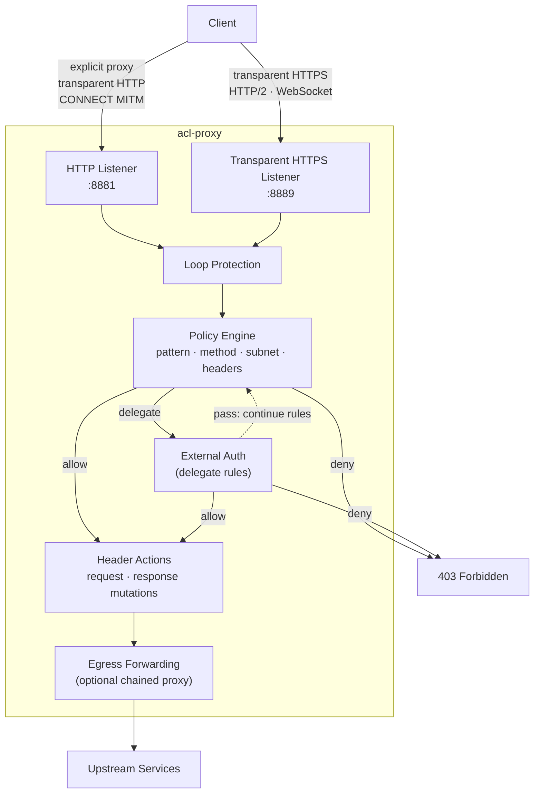
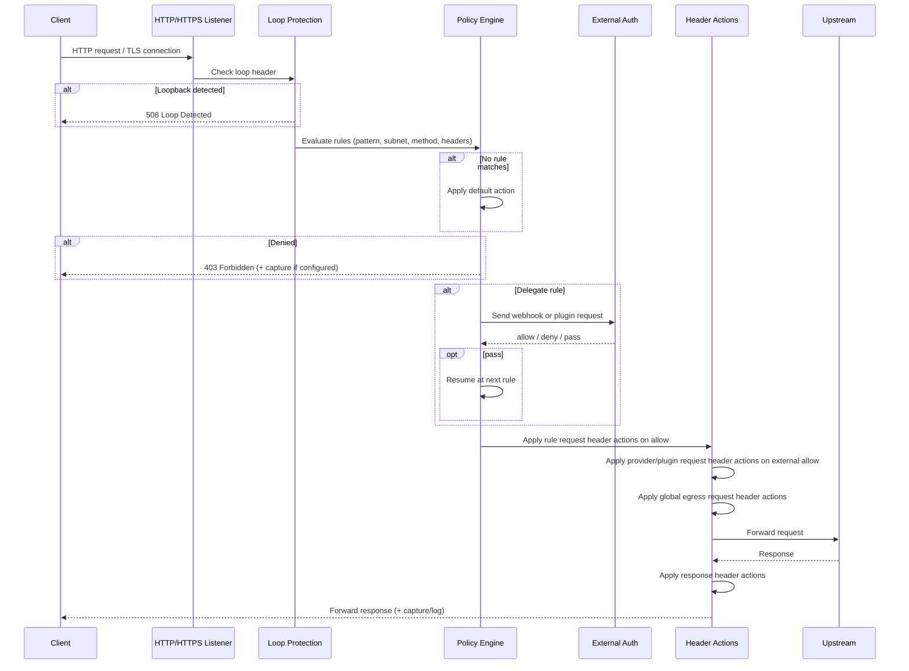
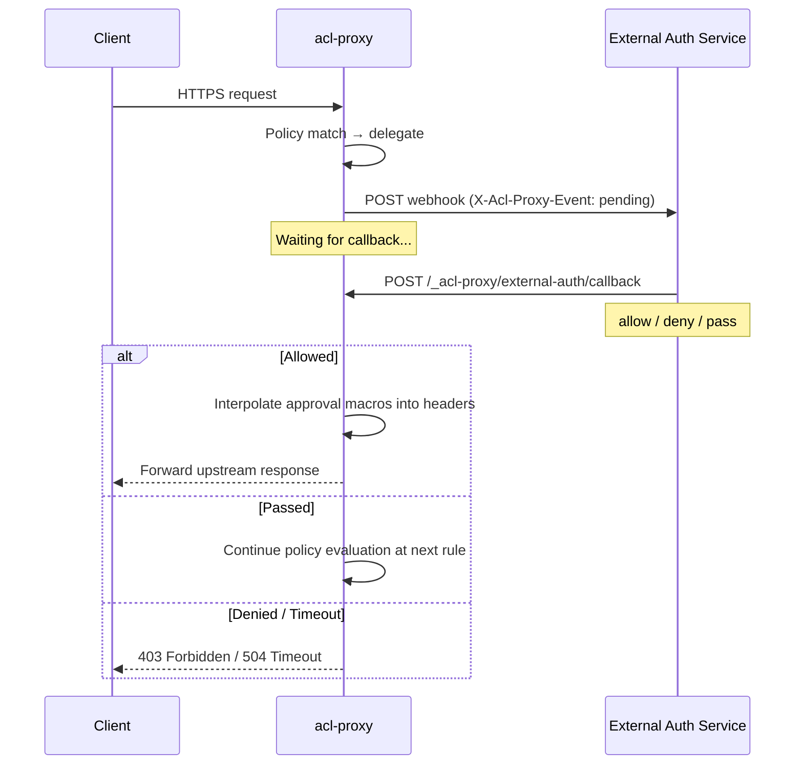
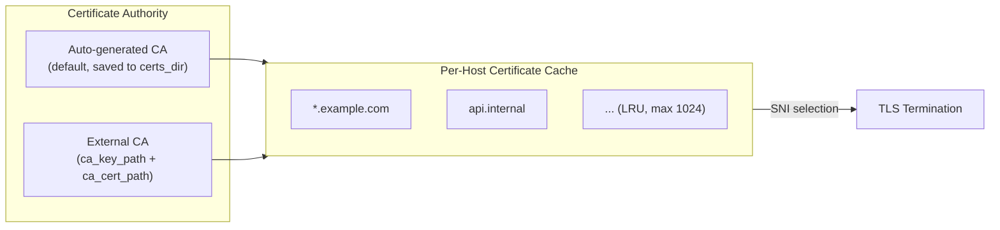

# acl-proxy

A Rust-based ACL-aware HTTP/HTTPS proxy with a TOML configuration file and a flexible URL policy engine. Evaluate every request against ordered rules matching on URL patterns, HTTP methods, client subnets, and headers — then allow, deny, or delegate to an external auth workflow.

## Table of Contents

- [How It Works](#how-it-works)
- [Install](#install)
- [Quick Start](#quick-start)
- [Proxy Modes](#proxy-modes)
- [Policy Engine](#policy-engine)
- [Configuration Reference](#configuration-reference)
- [External Auth](#external-auth)
- [Operations](#operations)
- [TLS & Certificates](#tls--certificates)
- [Logging & Capture](#logging--capture)
- [CLI Reference](#cli-reference)
- [Troubleshooting](#troubleshooting)
- [Project Structure](#project-structure)
- [Development](#development)
- [Demos](#demos)
- [License](#license)

## How It Works

acl-proxy sits between clients and upstream services, intercepting HTTP and HTTPS traffic across four request paths. Every request is evaluated by the same policy engine regardless of how it enters the proxy.



**Policy evaluation order** for each rule: pattern → subnets → methods → `headers_absent` → `headers_match` → `headers_not_match`. Local `allow`/`deny` matches are terminal. A matched `delegate` rule calls external auth; external `pass` continues with the next rule, and if nothing later matches, `policy.default` applies.

## Install

Download the latest archive for your platform from GitHub Releases:

```text
https://github.com/kcosr/acl-proxy/releases
```

Supported release platforms are currently:

- `linux-x86_64`
- `macos-arm64`

Extract the archive on the host that will run `acl-proxy`. The archive contains
the optimized proxy binary, capture-body helper, sample config, README, and
changelog.

Install on the host:

```bash
RELEASE_ROOT=/path/to/acl-proxy-VERSION-PLATFORM

sudo install -m 0755 "$RELEASE_ROOT/bin/acl-proxy" /usr/local/bin/acl-proxy
sudo install -m 0755 "$RELEASE_ROOT/bin/acl-proxy-extract-capture-body" \
  /usr/local/bin/acl-proxy-extract-capture-body
sudo install -d -m 0755 /etc/acl-proxy
sudo install -m 0644 "$RELEASE_ROOT/acl-proxy.sample.toml" \
  /etc/acl-proxy/acl-proxy.toml
```

For unsupported platforms or local development, build from source in the
[Development](#development) section.

## Quick Start

### 1. Create a Configuration

The install step copies the sample config to `/etc/acl-proxy/acl-proxy.toml`.
Edit that file for the policy you want to run. To replace it with a minimal
deny-all config:

```bash
sudo acl-proxy config init /etc/acl-proxy/acl-proxy.toml
```

If you are developing from a source checkout, you can also work with a local
config file:

```bash
mkdir -p config
cp acl-proxy.sample.toml config/acl-proxy.toml
```

The generated minimal config defaults to deny-all and disables capture.

### 2. Validate & Run

```bash
# Validate configuration
acl-proxy config validate --config /etc/acl-proxy/acl-proxy.toml

# Start the proxy
acl-proxy --config /etc/acl-proxy/acl-proxy.toml
```

The proxy starts:
- The HTTP listener on `proxy.bind_address:proxy.http_port` (explicit proxy and transparent HTTP interception).
- The transparent HTTPS listener on `proxy.https_bind_address:proxy.https_port` if `https_port` is non-zero.

### 3. Send Traffic

```bash
# Check readiness
curl http://127.0.0.1:8881/_acl-proxy/ready

# HTTP explicit proxy
curl -x http://127.0.0.1:8881 http://example.com/

# Transparent HTTP interception (local testing)
curl http://example.com/path \
  --connect-to example.com:80:127.0.0.1:8881

# HTTPS proxy (CONNECT MITM)
curl -x http://127.0.0.1:8881 https://example.com/ \
  --proxy-cacert certs/ca-cert.pem

# Transparent HTTPS listener
curl https://upstream.internal/resource \
  --connect-to upstream.internal:443:127.0.0.1:8889 \
  --cacert certs/ca-cert.pem
```

Or run directly with Cargo during development:

```bash
cargo run -- --config config/acl-proxy.toml
```

## Proxy Modes

acl-proxy supports four request paths. All modes apply the same policy engine, logging, capture, and header actions.

| Mode | Listener | Protocol | Description |
|------|----------|----------|-------------|
| **Explicit HTTP proxy** | `http_port` | HTTP/1.1 | Absolute-form requests via `curl -x` |
| **Transparent HTTP** | `http_port` | HTTP/1.1 | Origin-form requests with `Host` header (e.g., iptables `REDIRECT`/DNAT from port 80) |
| **CONNECT MITM** | `http_port` | HTTPS | TLS terminated inside tunnel with per-host CA-signed certs; inner requests processed as HTTP/1.1 |
| **Transparent HTTPS** | `https_port` | HTTPS | Direct TLS termination; HTTP/1.1 and HTTP/2 via ALPN negotiation |

### Request Lifecycle



Forwarded requests and responses strip hop-by-hop and proxy-control headers, including headers named by `Connection`, `Proxy-Authorization`, and `Proxy-Connection`. Rule/plugin/global header actions run after request filtering, and response header actions run after response filtering.

### Transparent HTTP Interception

In transparent HTTP mode, upstream target selection is based on the inbound `Host` header (`:80` when no port is present). Use restrictive policy rules for the destinations you intend to allow.

### HTTPS CONNECT (MITM)

- Policy is evaluated on each decrypted request; the CONNECT request itself is only used to establish the tunnel.
- Request-header predicates (`headers_absent`, `headers_match`, `headers_not_match`) apply only to decrypted inner requests, not to the outer CONNECT establishment request.
- Loop protection runs on both the CONNECT request and the inner requests.
- The outer CONNECT handshake remains local to the first proxy hop. If egress forwarding is enabled, only the decrypted inner HTTPS requests use the egress destination.
- Clients must trust the proxy CA (`certs/ca-cert.pem` by default).

### Transparent HTTPS

- Set `https_port = 0` to disable this listener.
- URL construction is based on the Host header or the request URI authority and uses the same canonicalization as policy matching.
- TLS SNI is used only to select the inbound certificate presented to the client. It is not treated as a policy or routing authority and is not required to match the decrypted HTTP `Host` header.
- Inbound HTTP/2 is supported via ALPN negotiation.
- If the Host header is missing or invalid, the proxy returns `400 Bad Request`.

### WebSocket and Upgrade Traffic

- HTTP/1.1 upgrade handshakes are proxied on all HTTP/1.1 request paths (HTTP listener, CONNECT inner, transparent HTTPS when HTTP/1.1 is negotiated).
- After a `101 Switching Protocols` response, acl-proxy switches to a bidirectional byte tunnel between client and upstream unless the matched rule names a `redaction_profile`.
- A matched redaction profile parses WebSocket frames, buffers one complete client-to-upstream data message at a time up to the configured limit, applies native redaction, and then reframes the message. Upstream-to-client messages and ping, pong, and close control frames are forwarded promptly and are not redacted; the configured per-frame safety limit still applies in both directions.
- Redacted WebSocket rules can optionally allow `permessage-deflate`; acl-proxy requires no-context-takeover parameters, decompresses client-to-upstream messages for redaction, and recompresses them before forwarding. Unsupported extensions are denied or stripped according to the profile.
- Matching policy rules can set `allow_upgrades = false` to deny HTTP/1.1 upgrade handshakes, including WebSocket handshakes, before delegate/plugin invocation or upstream forwarding.
- `allow_upgrades` is a rule-level control; requests that match no rule and fall through to `policy.default = "allow"` keep the default upgrade tunneling behavior.
- WebSocket payloads are not captured to disk. Existing request/response capture can still record handshake metadata.
- HTTP/2 extended CONNECT / RFC 8441 is not currently implemented.

### Upstream HTTP Version

By default, acl-proxy uses HTTP/1.1 for upstream connections, even when clients speak HTTP/2 to the proxy. To enable upstream HTTP/2:

```toml
[tls]
enable_http2_upstream = true
```

When enabled, ALPN is used per origin; the proxy will use HTTP/2 where supported and fall back to HTTP/1.1 otherwise.

### Chained Proxy Deployments

When `[proxy.egress.default]` is configured, allowed proxied requests from all modes are sent to the configured egress host:port instead of the original target.

- The forwarding leg remains cleartext TCP — deploy on a trusted/local network path.
- Forwarding is protocol-aware: HTTP/2 requests use h2c, HTTP/1.1 (including WebSocket) stays HTTP/1.1.
- The forwarded request keeps the original target URI and `Host` header, so the outer proxy still evaluates policy against the real target.
- The recommended egress target is the outer proxy's HTTP listener (`proxy.http_port`), not the transparent HTTPS listener.

**Loop prevention**: If both hops use loop protection, either configure different `loop_protection.header_name` values per hop, or disable outbound injection on the inner proxy with `loop_protection.add_header = false`.

**Timeout guidance**: Set the inner proxy timeout high enough to cover the outer proxy timeout plus its upstream work.

## Policy Engine

The policy engine evaluates each request against an ordered list of rules. `allow` and `deny` rules are terminal local decisions. `delegate` rules call an external auth profile, whose decision can allow, deny, or pass so evaluation continues at the next rule. If no rule matches, `policy.default` applies. Invalid or unparseable URLs are always denied.

### Rule Evaluation Order

1. Normalize the request URL.
2. Normalize the client IP (if present).
3. Normalize the HTTP method (if present).
4. Evaluate rules in the order they appear:
   - Pattern match (if set)
   - Subnet match (if set)
   - Method match (if set)
   - `headers_absent` match (if set)
   - `headers_match` match (if set)
   - `headers_not_match` match (if set)
5. The first `allow` or `deny` match wins. A matched `delegate` rule wins only when the external auth provider returns `allow` or `deny`.
6. If nothing matches, apply `policy.default`.

All predicates use AND semantics — a rule matches only when every predicate passes.

### URL Normalization

Before applying rules or forwarding the request upstream, acl-proxy canonicalizes input URLs to:

```
protocol + "//" + host[:port] + path + optional "?query"
```

- The scheme is preserved (`http:` or `https:`).
- Only `http` and `https` URLs are accepted. URLs with userinfo are rejected.
- Hostnames are lowercased and a trailing DNS dot is removed.
- Default ports (`:80` for HTTP, `:443` for HTTPS) are omitted; non-default ports are preserved.
- Dot segments in the path are resolved before matching or forwarding.
- The path defaults to `/` when empty.
- Query strings are preserved; fragments are ignored.
- IPv6 hostnames use standard bracket notation (e.g., `https://[::1]:8443/path`).

### Pattern Syntax

Patterns are matched case-insensitively against normalized URLs.

- **Scheme is optional**: `https://example.com/**` and `example.com/**` both match `https` and `http`.
- **Wildcards**:
  - `*` matches any sequence of characters except `/`.
  - `**` matches any sequence of characters including `/`.
- **Host-only patterns**: `https://example.com` matches `https://example.com` and `https://example.com/` but not deeper paths.

Examples:

```
https://example.com/api/**        # any path under /api
https://example.com/api/*/v1      # one segment between /api and /v1
example.com                       # host-only, any scheme
```

### Methods

Methods are specified as a string or list of strings and normalized to uppercase:

```toml
methods = "POST"
methods = ["GET", "HEAD"]
```

Rules without `methods` have no method restriction.

### Subnets

Client IP subnets are specified as IPv4 or IPv6 CIDR ranges:

```toml
subnets = ["10.0.0.0/8", "192.168.0.0/16", "::1/128"]
```

Client IP normalization:
- Strips interface suffixes after `%` (e.g., `fe80::1%eth0` → `fe80::1`).
- Maps `::ffff:x.y.z.w` to `x.y.z.w`.
- Maps `::1` to `127.0.0.1`.

### Header-Absence Predicate

Rules can match on missing inbound request headers:

```toml
[[policy.rules]]
action = "deny"
pattern = "**"
headers_absent = ["x-workload-id"]
description = "Deny requests missing workload identity"
```

- Matches when any listed request header is missing.
- Header-name lookup is case-insensitive.
- A header present with an empty value still counts as present.
- When all listed headers are present, the rule falls through to the next rule.
- On HTTPS over CONNECT, applies to the decrypted inner request, not the outer CONNECT.

### Header-Value Predicate

Rules can require exact inbound request-header values:

```toml
[[policy.rules]]
action = "allow"
pattern = "https://api.internal.example.com/**"
headers_match = { "x-workload-id" = ["worker-123", "worker-456"], "x-tenant-id" = "tenant-a" }
description = "Allow trusted workload identities"
```

- Across header keys: `AND` semantics.
- Within one key's values: `OR` semantics.
- Header names are case-insensitive.
- Value matching is exact and case-sensitive — no trimming, no comma splitting.
- Repeated inbound header values are supported; any exact match satisfies that key.
- Empty configured values are rejected during config validation.
- When both `headers_absent` and `headers_match` are configured, both predicates must pass.

### Header-Value Exclusion Predicate

Rules can match when inbound request headers are missing or do not contain specific exact values:

```toml
[[policy.rules]]
action = "deny"
pattern = "https://pi.dev/**"
headers_not_match = { "x-aw-policy-context" = ["internal"] }
description = "Deny non-internal contexts"
```

- Across header keys: `AND` semantics.
- Within one key's configured values: no received value may exactly match any configured value.
- Header names are case-insensitive.
- Value matching is exact and case-sensitive — no trimming, no comma splitting.
- A missing header satisfies `headers_not_match`.
- Repeated inbound header values are supported; any exact excluded value makes that key fail the predicate.
- Empty configured values are rejected during config validation.
- `headers_not_match` combines with `headers_absent` and `headers_match` conjunctively.
- Header values used for policy must be trusted before acl-proxy receives the request; rule and global header actions run after matching and do not make client-supplied headers authoritative.

### Multiple URL Patterns

Use `patterns = [...]` when several URL patterns should share identical rule attributes:

```toml
[[policy.rules]]
action = "allow"
patterns = [
  "https://developers.openai.com/**",
  "https://github.com/openai/**",
  "https://raw.githubusercontent.com/openai/**",
  "https://api.github.com/repos/openai/**",
]
methods = ["GET"]
description = "OpenAI docs and repositories"
```

- Use `pattern = "..."` for one URL pattern and `patterns = ["...", "..."]` for several.
- `pattern` and `patterns` are mutually exclusive.
- `patterns` must include at least one non-empty pattern; entries are trimmed before expansion.
- A multi-pattern rule expands into one effective rule per pattern, preserving configured pattern order and first-match-wins behavior.
- `policy dump` shows the expanded effective rules with singular `pattern` values.
- Policy decision logs report the specific matched effective `rule_pattern`, not the original `patterns` array.
- `rule_id` is rejected on multi-pattern rules because copied IDs would not be unique.

### Macros and Rulesets

Macros are named placeholders expanded before patterns are compiled:

```toml
[policy.macros]
repo = ["team/service-a", "team/service-b"]

[[policy.rulesets.git_repo]]
action = "allow"
pattern = "https://git.internal/{repo}.git/**"
description = "Git HTTP(S) for {repo}"
methods = ["GET", "POST"]
allow_upgrades = false              # optional: inherited by includes
```

Ruleset templates can also use `patterns = [...]`; include expansion emits one concrete rule for each template pattern.

Include rules expand a ruleset into concrete rules:

```toml
[[policy.rules]]
include = "git_repo"
add_url_enc_variants = true
methods = ["GET", "POST"]           # overrides template methods
subnets = ["10.0.0.0/8"]           # overrides template subnets
```

- `with` provides macro overrides specific to this include.
- `add_url_enc_variants = true` generates both raw and URL-encoded variants for all placeholders.
- `methods` and `subnets` on the include override the template values; when omitted, template values are used.
- `headers_absent`, `headers_match`, `headers_not_match`, and `allow_upgrades` are inherited from the template, not overridden.
- Missing macros required by a ruleset cause validation failure.

### Header Actions

Rules can modify headers on matching requests and responses. Actions do not participate in rule matching — they run only after a rule matches.

```toml
[[policy.rules]]
action = "allow"
pattern = "https://github.com/**"

  [[policy.rules.header_actions]]
  direction = "request"          # request | response | both
  action    = "set"              # set | add | remove | replace_substring
  name      = "user-agent"
  value     = "acl-proxy/1.0"
  when      = "always"           # always | if_present | if_absent

  [[policy.rules.header_actions]]
  direction = "response"
  action    = "replace_substring"
  name      = "x-upstream-tag"
  search    = "old"
  replace   = "new"
```

| Action | Description |
|--------|-------------|
| `set` | Replace all existing values with the configured value(s) |
| `add` | Append new values without removing existing ones |
| `remove` | Delete the header entirely |
| `replace_substring` | Find and replace within each current value |

**`when` conditions**: `always` (default), `if_present`, `if_absent` — evaluated against the original header state before any actions for that direction run.

**`value` / `values`**: Exactly one must be provided for `set`/`add`. Values must be valid HTTP header values.

**Environment variable interpolation**: Exact whole-string `${NAME}` placeholders in header action `value`/`values`, redaction profile `replacement`, and redaction rule `literals` resolve once at config load/reload time. `NAME` must match `[A-Za-z_][A-Za-z0-9_]*`. Complete `${...}` sequences trigger interpolation validation; mixed strings like `Bearer ${TOKEN}` are rejected, while incomplete markers like `${TOKEN` are treated as literal text with a warning. Missing env vars fail validation, startup, and reload.

**Approval macros**: `{{name}}` placeholders are a separate feature for external auth workflows — they are not resolved at config load time. See [External Auth](#external-auth).

### Global Egress Request Header Actions

A global request-only layer under `[[proxy.egress.request_header_actions]]` applies the same outbound mutations to every forwarded request after matched-rule/plugin request actions.

```toml
[[proxy.egress.request_header_actions]]
action = "set"
name = "x-egress-tag"
value = "edge-a"
when = "always"
```

Ordering for outbound requests:
1. Evaluate policy and match the first rule.
2. For a local `allow`, apply matched-rule request header actions. For `delegate`, apply matched-rule request header actions only if the provider returns `allow`.
3. Apply provider/plugin request header actions only on external `allow`.
4. Apply global egress request header actions.
5. Send upstream.

Global egress actions never affect rule matching. Their `when` conditions are evaluated against header presence at the start of the global layer (after rule/provider actions). On external `pass`, no rule or provider header actions are applied and later policy rules evaluate the original request headers. Global response-header actions are not supported — only request-direction actions are available in this layer.

### Debugging Policies

Use the policy inspection CLI to see the fully expanded rule set:

```bash
acl-proxy policy dump --config config/acl-proxy.toml
acl-proxy policy dump --format table
acl-proxy policy dump --format json
```

`policy dump` defaults to table output on a TTY and JSON otherwise. It includes `headers_match` and `headers_not_match` values — treat output as sensitive when those values represent credentials. Header action values loaded from `${NAME}` env placeholders are shown as `[REDACTED]`.
When a rule uses `patterns`, the dump shows one effective row/object per expanded pattern with a singular `pattern` field.

## Configuration Reference

### Config File Resolution

The proxy resolves the config path in this order:

1. `--config <path>` CLI argument
2. `ACL_PROXY_CONFIG` environment variable
3. `config/acl-proxy.toml` (relative to the current working directory)

If the default path is missing, the CLI suggests running `acl-proxy config init`.

### Environment Variable Overrides

After parsing the config file, these overrides are applied:

| Variable | Config Field | Default |
|----------|-------------|---------|
| `PROXY_PORT` | `proxy.http_port` (valid `u16`) | `8881` |
| `PROXY_HOST` | `proxy.bind_address` | `0.0.0.0` |
| `LOG_LEVEL` | `logging.level` | `info` |

### Top-Level Sections

```toml
schema_version = "1"          # required; only "1" is supported

[proxy]
[proxy.egress]
[[proxy.egress.request_header_actions]]
[logging]
[capture]
[loop_protection]
[certificates]
[tls]
[external_auth]
[policy]
```

All sections except `schema_version` and `[policy].default` are optional with sensible defaults. Unknown keys in structured config sections, rules, ruleset templates, and profiles are rejected so typos such as `method` instead of `methods` do not silently weaken policy.

### `[proxy]` — Listeners and Ports

```toml
[proxy]
bind_address = "0.0.0.0"           # IP for the HTTP listener
http_port = 8881                    # port for HTTP listener (0 = ephemeral)
https_bind_address = "0.0.0.0"     # IP for the transparent HTTPS listener
https_port = 8889                   # port for HTTPS listener (0 = disabled)
request_timeout_ms = 30000          # upstream timeout; 0 = disabled
https_handshake_timeout_ms = 10000  # transparent HTTPS TLS handshake timeout; 0 = disabled
https_request_header_timeout_ms = 10000 # transparent HTTPS HTTP/1 header timeout; 0 = disabled
https_max_connections = 1024        # active transparent HTTPS connections; 0 = unlimited
https_http2_max_concurrent_streams = 128 # per-connection HTTP/2 stream cap; 0 = unlimited
internal_base_path = "/_acl-proxy"  # base path for internal endpoints
```

- `internal_base_path` must start with `/` and must not end with `/` (except root `/`). Internal endpoints are only matched for origin-form (direct) requests, not proxy-style absolute-form requests.
- Listener bind addresses must be IP literals. If both HTTP and transparent HTTPS listeners use fixed non-zero ports, overlapping bind addresses cannot use the same port.
- The default bind addresses listen on all interfaces. Set `bind_address` and `https_bind_address` to loopback addresses, or restrict access with firewall rules, when the proxy should be local-only.
- The transparent HTTPS timeout and connection-cap settings apply at the listener boundary before request policy is evaluated.

### `[proxy.egress.default]` — Optional Forwarding Destination

```toml
[proxy.egress.default]
host = "172.17.0.1"                # DNS hostname or IP; IPv6 bare (::1) or bracketed ([::1])
port = 8889                         # TCP port (1–65535)
```

When present, allowed request-forwarding paths use this egress destination as the outbound TCP dial target while policy matching, logging, and the forwarded `Host` header remain bound to the original request target. When absent, the proxy connects directly to each request's original target.

### `[logging]` — Logging

```toml
[logging]
level = "info"                      # trace | debug | info | warn | error
directory = "logs"                  # omit for console-only
max_bytes = 104857600               # rotation threshold (bytes)
max_files = 5                       # rotated files to keep
console = true                      # also write to stdout
```

- When `directory` is set, logs go to `{directory}/acl-proxy.log` and rotate by size.
- Log writing is non-blocking; when the internal buffer fills, entries are dropped to avoid stalling requests.
- Transport logs on `acl_proxy::transport` (debug level) include per-request ingress, egress-attempt, egress, and completion events.
- URLs emitted to policy-decision and proxy debug logs have userinfo removed and query strings replaced with `REDACTED`.

### `[logging.policy_decisions]` — Policy Decision Logging

```toml
[logging.policy_decisions]
log_allows = false                  # log allowed decisions
log_denies = true                   # log denied decisions
level_allows = "info"               # log level for allows
level_denies = "warn"               # log level for denies
```

Policy decision events are emitted to the `acl_proxy::policy` target with structured fields: `request_id`, `allowed`, `url`, `method`, `client_ip`, `rule_action`, `rule_pattern`, `rule_description`, and optional `reason`. The `url` field is sanitized before logging.

On Unix, log directories are created or tightened to owner-only (`0700`) and log files are created or tightened to owner-only (`0600`).

### `[capture]` — Request/Response Capture

```toml
[capture]
allowed_request = false             # capture allowed request records
allowed_response = false            # capture allowed response records
denied_request = false              # capture denied request records
denied_response = false             # capture denied response records
directory = "logs-capture"          # base directory for capture files
filename = "{requestId}-{suffix}.json"   # template ({requestId}, {kind}, {suffix})
max_body_bytes = 1048576            # max body bytes to serialize (1 MiB; 0 = skip body)
max_files = 10000                   # max capture files to retain
max_total_bytes = 1073741824        # max total capture directory bytes to retain (1 GiB)
```

Capture happens for:
- Allowed requests/responses when the corresponding flags are enabled.
- Denied requests/responses for policy or loop protection when denied flags are enabled.
- Upstream failures (502/504) as allowed traffic when capture is enabled.

`body.length` always records the full on-wire body length even when `body.data` is truncated. When a captured body has an HTTP `Content-Encoding`, the raw captured bytes remain content-encoded and the body object records `contentEncoding`.

`capture.filename` must be a filename template, not a path. Use `capture.directory` to choose the output directory; templates containing path separators, absolute paths, or `..` path segments are rejected.

After each capture write, acl-proxy prunes older regular files in `capture.directory` until both `capture.max_files` and `capture.max_total_bytes` are satisfied. The newest just-written capture file is retained even if a single file exceeds the byte cap.

On Unix, capture directories are created or tightened to owner-only (`0700`) and capture JSON files are created or tightened to owner-only (`0600`). Capture URLs have userinfo removed and query strings replaced with `REDACTED`; `Authorization`, `Proxy-Authorization`, `Cookie`, and `Set-Cookie` header values are replaced with `[REDACTED]`. Capture bodies and other headers can still contain sensitive decrypted data; treat capture files as sensitive.

#### Capture Record Format

Each JSON file contains a single object:

| Field | Type | Description |
|-------|------|-------------|
| `timestamp` | string | RFC 3339 timestamp |
| `requestId` | string | Internal request ID |
| `kind` | string | `"request"` or `"response"` |
| `decision` | string | `"allow"` or `"deny"` |
| `mode` | string | `"http_proxy"`, `"https_connect"`, or `"https_transparent"` |
| `url` | string | Normalized URL with userinfo removed, query redacted, and no fragment |
| `method` | string | HTTP method |
| `httpVersion` | string | e.g., `"1.1"`, `"2"` |
| `statusCode` | number | HTTP status code (responses only) |
| `statusMessage` | string | Status message (responses only) |
| `client` | object | `address` (string), `port` (number) |
| `target` | object | Upstream `address` and `port` (when available) |
| `headers` | object | Lowercase keys; values are string or string array; common credential headers are redacted |
| `body` | object | `encoding` (`"base64"`), `length` (full on-wire length), `data` (base64), `contentType`, `contentEncoding` |

#### Extract Captured Bodies

```bash
acl-proxy-extract-capture-body logs-capture/req-123-res.json > body.bin
```

Reports errors for invalid JSON, missing bodies, or unsupported capture encodings. If the capture body has an HTTP `contentEncoding`, the tool prints a warning because stdout contains the still-content-encoded bytes after base64 decoding.

### `[loop_protection]` — Loop Detection

```toml
[loop_protection]
enabled = true                      # enable loop detection on all paths
add_header = true                   # inject header into outbound requests
header_name = "x-acl-proxy-request-id"  # header name for detection/injection
```

When an inbound request contains the loop header and loop protection is enabled, the proxy responds with:
- Status: `508 Loop Detected`
- Body: `{ "error": "LoopDetected", "message": "Proxy loop detected via loop protection header" }`

Loop detection runs on: HTTP listener requests (explicit + transparent), CONNECT requests, decrypted CONNECT inner requests, and transparent HTTPS requests.

### `[certificates]` — CA and Per-Host Certificates

```toml
[certificates]
certs_dir = "certs"                 # base directory for certificate material
ca_key_path = "/path/to/ca-key.pem"   # optional external CA key
ca_cert_path = "/path/to/ca-cert.pem" # optional external CA cert
max_cached_certs = 1024             # LRU cache size (min 1)
persist_dynamic_certs = false       # write per-host debug PEMs under certs_dir/dynamic
```

- When both `ca_key_path` and `ca_cert_path` are absent, the proxy auto-generates a CA in `certs_dir` and reuses it if valid files already exist.
- When both are provided, the proxy uses them as-is; invalid/unreadable files cause a startup error.
- When only one is provided, validation fails — both must be set or both omitted.
- Per-host certificates are generated on demand and cached in memory (LRU). By default they are not written to disk, which keeps attacker-supplied hostnames from growing `certs_dir/dynamic/` without bound.
- When `persist_dynamic_certs = true`, generated per-host debug PEMs are written to `certs_dir/dynamic/` as `<host>.crt`, `<host>.key`, and `<host>-chain.crt`. These files are not reloaded on startup.
- On Unix, certificate directories are created or tightened to owner-only (`0700`) and generated CA/per-host PEM files that are written to disk are created or tightened to owner-only (`0600`).

### `[tls]` — Upstream TLS Behavior

```toml
[tls]
verify_upstream = true              # verify upstream HTTPS certificates
enable_http2_upstream = false       # HTTP/1.1-only by default
```

- `verify_upstream = false` accepts all upstream certificates regardless of host or issuer. Use only in controlled test environments.
- `enable_http2_upstream = true` lets ALPN negotiation choose HTTP/2 per origin; the proxy falls back to HTTP/1.1 when the origin doesn't advertise `h2`.

These settings affect only outbound TLS from proxy to upstream. Incoming TLS is always terminated using the proxy's CA.

### `[external_auth]` — External Auth Settings

```toml
[external_auth]
callback_url = "https://proxy.example.com/_acl-proxy/external-auth/callback"
```

`callback_url` must be an absolute URL with a host. Empty or relative values are rejected. This value is included in external auth webhooks as `callbackUrl`.

### `[policy]` — Policy Engine

```toml
[policy]
default = "deny"                    # "allow" or "deny" (case-insensitive)
```

See [Policy Engine](#policy-engine) for full details on rules, macros, rulesets, and header actions.

#### Direct Rule Fields

```toml
[[policy.rules]]
action = "allow"                    # required: "allow" | "deny" | "delegate"
pattern = "https://example.com/**"  # optional: URL pattern
# patterns = ["https://a/**"]       # optional alternative: multiple URL patterns
description = "Example rule"        # optional
methods = ["GET", "POST"]           # optional: HTTP methods
subnets = ["10.0.0.0/8"]           # optional: client IP CIDRs
headers_absent = ["x-id"]          # optional: missing-header check
headers_match = { "x-id" = "v1" }  # optional: exact header match
headers_not_match = { "x-id" = "internal" } # optional: exact header exclusion
request_timeout_ms = 5000          # optional: override upstream timeout
allow_upgrades = true              # optional: deny HTTP/1.1 upgrades when false
redaction_profile = "secrets"      # optional: native request/WebSocket redaction profile for allow/delegate
rule_id = "stable-id"             # optional: stable ID for webhooks
external_auth_profile = "name"     # required for delegate; invalid for allow/deny
```

At least one of `pattern`, `patterns`, `methods`, `subnets`, `headers_absent`, `headers_match`, or `headers_not_match` must be present.
`allow` and `deny` are terminal local decisions. `delegate` invokes the named HTTP or plugin external auth profile; the provider can return `allow` or `deny` as terminal decisions, or `pass` to continue policy evaluation at the next rule.
When a matched rule has `allow_upgrades = false`, HTTP/1.1 upgrade requests are denied locally with `403 Forbidden` before the rule action runs. Normal HTTP requests matching the same rule continue through `allow`, `deny`, or `delegate` behavior as usual.
`redaction_profile` is valid only on `allow` and `delegate` rules. The named profile must exist under `[redaction.profiles.<name>]`; denied rules cannot name a profile because they never forward payload data.

#### Native Redaction Profiles

```toml
[redaction.profiles.secrets]
replacement = "[REDACTED]"
max_body_bytes = 10485760
max_decoded_body_bytes = 52428800
max_frame_bytes = 262144
max_message_bytes = 1048576
allow_permessage_deflate = false
unsupported_extensions = "deny" # deny | strip

[[redaction.profiles.secrets.rules]]
literals = ["password", "api-token"]
expressions = ["(?i)bearer\\s+[a-z0-9._-]+"]
match = "text"                    # text | binary | both
```

Profiles redact outbound/request-side data only. For normal HTTP requests with a body, acl-proxy buffers the request body, decompresses supported `Content-Encoding` values, applies literal and regex redaction in-process, recompresses with the original encoding, updates body headers, and forwards upstream. Bodyless requests are forwarded without body-header rewrites. For HTTP/1.1 WebSocket upgrades, acl-proxy applies the same profile to client-to-upstream data messages after an allowed `101 Switching Protocols`; upstream-to-client messages are not redacted or message-buffered.

Profiles are intended for short, known secrets such as fixed passwords or tokens. `replacement` is fixed per profile and can have any length. A redacted upgrade whose `Upgrade` header is not `websocket` is rejected before upstream forwarding. If the upstream negotiates unsupported WebSocket extensions, acl-proxy returns `502 Bad Gateway` before delivering `101 Switching Protocols` to the client.

Redaction `replacement` and `literals` support exact whole-string `${NAME}` environment placeholders. Placeholders are resolved during config load and reload; missing variables or mixed literal/env strings fail validation. Literal redaction strings containing complete `${...}` sequences are treated as interpolation attempts; supply those values through an exact env placeholder. Regex `expressions` do not support environment interpolation.

Regex `expressions` use Rust regex syntax, are text-only, and cannot be used with `match = "binary"`. Expressions that can match empty text are rejected to avoid unbounded replacement expansion.

#### Include Rule Fields

```toml
[[policy.rules]]
include = "ruleset_name"            # required: reference a ruleset
with = { repo = "override" }       # optional: macro overrides
add_url_enc_variants = true         # optional: URL-encode placeholders
methods = ["GET"]                   # optional: override template methods
subnets = ["10.0.0.0/8"]           # optional: override template subnets
request_timeout_ms = 5000          # optional: override template timeout
```

#### Approval Macro Descriptors

```toml
[policy.approval_macros]
github_token = { label = "GitHub token", required = true, secret = true }
reason       = { label = "Approval reason", required = false, secret = false }
```

- `label`: Human-friendly label for approver UIs (defaults to macro name).
- `required`: Whether the approver must supply a non-empty value (default `true`).
- `secret`: Hint to mask input and avoid logging (default `false`).

#### External Auth Profile Fields

```toml
[policy.external_auth_profiles.github_mfa]
type = "http"                       # "http" (default) | "plugin"
webhook_url = "https://..."         # required for type = "http"
timeout_ms = 5000                   # required: approval/plugin timeout
webhook_timeout_ms = 1000           # optional: webhook delivery timeout; defaults to timeout_ms
on_webhook_failure = "error"        # "deny" | "error" | "timeout"

[policy.external_auth_profiles.url_allow]
type = "plugin"
command = "/usr/local/bin/url-allow" # required for type = "plugin"
args = ["--config", "/etc/url-allow.json"]
timeout_ms = 1000
restart_delay_ms = 10000            # delay before restarting crashed plugin
include_headers = ["x-*"]           # header name globs to forward
include_request_body = false        # optional body-aware plugin delegation
max_request_body_bytes = 10485760   # encoded limit, 10 MiB
max_decompressed_request_body_bytes = 52428800 # decoded body limit, 50 MiB
env = { KEY = "value" }             # env vars for the plugin process
```

### Minimal Configuration

```toml
schema_version = "1"

[proxy]
bind_address = "0.0.0.0"
http_port = 8881
https_bind_address = "0.0.0.0"
https_port = 8889
request_timeout_ms = 30000
https_handshake_timeout_ms = 10000
https_request_header_timeout_ms = 10000
https_max_connections = 1024
https_http2_max_concurrent_streams = 128
internal_base_path = "/_acl-proxy"

[logging]
level = "info"

[policy]
default = "deny"
```

The repository includes [`acl-proxy.sample.toml`](acl-proxy.sample.toml) as a comprehensive example covering all options.

### Validation

The config loader performs validation beyond basic TOML parsing:

- `schema_version` must equal `"1"`.
- Unknown keys in structured tables are rejected during TOML parsing.
- Direct rules must have at least one of `pattern`, `patterns`, `methods`, `subnets`, `headers_absent`, `headers_match`, or `headers_not_match`.
- Direct rules and ruleset templates must not define both `pattern` and `patterns`.
- `patterns` must include at least one non-empty pattern.
- Duplicate `patterns` entries are rejected after trimming.
- Include rules must reference an existing ruleset.
- Macro placeholders (`{name}`) must resolve from `policy.macros` or `with` overrides.
- `ca_key_path` and `ca_cert_path` must be both set or both omitted.
- Listener bind addresses must parse as IP addresses, and overlapping HTTP/HTTPS listener binds must not use the same fixed port.
- `loop_protection.header_name` must be a valid HTTP header name.
- `${NAME}` env placeholders must resolve at validation/startup/reload time. Existing literal `${...}` strings in `set`/`add` header-action values are reserved syntax and must be migrated.
- `policy.default` must be `allow` or `deny`; `delegate` is valid only on rules and ruleset templates.
- `action = "delegate"` requires `external_auth_profile`.
- `external_auth_profile` on `action = "allow"` or `action = "deny"` rules is rejected.
- External auth `timeout_ms` and configured `webhook_timeout_ms` values must be non-zero.
- `include_request_body = true` is supported only for `type = "plugin"` external auth profiles, and its body-size limits must be non-zero.

On validation failure, `config validate` and startup report a human-readable error and abort, leaving any previously running instance (in the case of reload) unchanged.

## External Auth

External auth is invoked by `delegate` policy rules. When a matching request hits a delegate rule, acl-proxy pauses the request, sends a webhook to an HTTP external auth service or invokes a stdio plugin, and waits for a decision.



### Webhook Format

When a `delegate` rule with `external_auth_profile` matches an HTTP profile, the proxy POSTs a webhook:

- **URL**: `policy.external_auth_profiles.<name>.webhook_url`
- **Header**: `X-Acl-Proxy-Event: pending`
- **Payload fields**: `requestId`, `profile`, `ruleIndex`, optional `ruleId`, `url`, `method`, `clientIp`, `status: "pending"`, `terminal: false`, `timestamp` (RFC3339), `elapsedMs`, `eventId`, `callbackUrl` (when configured), and `macros` (approval macro descriptors). The `url` field has userinfo removed and query strings replaced with `REDACTED`.

### Terminal Status Webhook

For lifecycle events (webhook failure, timeout, error, cancellation), the proxy emits a best-effort status webhook:

- **Header**: `X-Acl-Proxy-Event: status`
- **Fields**: `status` (`webhook_failed` | `timed_out` | `error` | `cancelled`), `terminal: true`, `reason`, sanitized `url`, optional `failureKind` and `httpStatus`.
- At most one terminal event per `requestId`.
- Status webhooks are **telemetry only** — delivery failures never affect the allow/deny decision.

### Callback Endpoint

```
POST /{internal_base_path}/external-auth/callback
Content-Type: application/json

{
  "requestId": "req-...",
  "decision": "allow" | "deny" | "pass",
  "macros": {
    "github_token": "ghp_...",
    "reason": "Approving for test"
  }
}
```

| Response | Condition |
|----------|-----------|
| `200 OK` with `{ "status": "ok" }` | Success |
| `404 Not Found` | Unknown or already completed `requestId` |
| `400 Bad Request` | Invalid body or missing required macros |

**Macro validation**: Required macros must be present and non-empty for `allow` decisions. Values must not contain control characters (ASCII < 0x20 or DEL). Optional macros may be omitted or empty. `pass` decisions do not apply approval macro substitutions or header actions; policy evaluation resumes at the rule after the matched delegate rule.

### Plugin Mode (type = "plugin")

Stdio-based synchronous auth. The proxy spawns a long-running plugin process and sends JSON requests over stdin, waiting for `allow`, `deny`, or `pass` JSON responses from stdout (newline-delimited). Plugin stdin writes are bounded by `timeout_ms`, stdout response lines are capped at 1 MiB, and protocol I/O failures restart the plugin after `restart_delay_ms`. On `allow`, the proxy applies rule header actions first, plugin header actions second, and global egress request actions third. On `pass`, the plugin must not return request or response header actions, and policy evaluation resumes at the rule after the matched delegate rule. Plugins can also return response header actions on `allow`. See [`docs/design/auth-plugins-design.md`](docs/design/auth-plugins-design.md) for the full protocol specification.

Plugin profiles can opt into request-body inspection and mutation:

```toml
[policy.external_auth_profiles.ai_guard]
type = "plugin"
command = "/usr/local/bin/ai-guard"
timeout_ms = 3000
include_headers = ["content-type", "authorization"]
include_request_body = true
max_request_body_bytes = 10485760
max_decompressed_request_body_bytes = 52428800
```

When `include_request_body = true`, acl-proxy buffers the outbound request body before forwarding, decompresses supported `Content-Encoding` bodies (`gzip`, `deflate`, `br`, and `zstd`), sends the decoded body to the plugin as base64, and can apply an optional `requestBody` replacement returned by an `allow` decision. The default encoded limit is 10 MiB and the default decompressed limit is 50 MiB. Plugin-returned replacement bodies are also capped by the decoded limit. `deflate` ingress accepts both zlib-wrapped and raw DEFLATE bodies; rewritten `deflate` bodies are emitted as zlib-wrapped DEFLATE. `zstd` decoding caps the accepted frame window based on the decompressed body limit. If the original request used a supported content encoding, the replacement body is recompressed with the same encoding before egress and `Content-Length` is rebuilt. Unsupported or stacked content encodings, body read failures, oversize encoded bodies, and oversize decoded bodies fail the delegated request with an auth-plugin error response. Plugin `deny` responses may include `denyMessage` to replace the client-visible JSON `message`; status remains `403` and JSON `error` remains `Forbidden`. `denyMessage` is valid only on `deny`; returning it on `allow` or `pass` is a protocol error.

Body-aware plugin delegation runs only when a request matches a `delegate` rule whose plugin profile has `include_request_body = true`. It works on all HTTP request-forwarding paths, including explicit HTTP proxying, transparent HTTP, CONNECT MITM inner requests, and transparent HTTPS after TLS termination. HTTP/1.1 upgrade/WebSocket traffic is not body-buffered for plugins. Use `allow_upgrades = false` when upgrade tunnels should be blocked before plugin invocation or upstream forwarding, or use native `redaction_profile` rules when known request/WebSocket message secrets should be redacted without a plugin.

Body-processing diagnostics are emitted with structured fields on the `acl_proxy::body_policy` tracing target at `debug` level. Logs include request ID, URL, profile, sizes, encoding, and decision metadata, but never log body contents.

The [`demos/body-inspection-plugin/`](demos/body-inspection-plugin/) directory includes a prototype plugin that applies literal and regex body rules, blocks matching requests, or returns same-length redactions through `requestBody`.

### Failure Handling

`on_webhook_failure` controls behavior when the initial webhook fails:

| Mode | Response |
|------|----------|
| `deny` | 403 Forbidden |
| `error` | 503 Service Unavailable (default) |
| `timeout` | 504 Gateway Timeout |

### Security Note

Callback decisions are authorized by the pending request's unguessable `requestId`, which is a bearer capability included in the pending webhook. Treat webhook payloads and callback URLs as sensitive, and restrict access to `/{internal_base_path}/external-auth/callback` using network policy or firewall rules.

## Operations

### Startup

`acl-proxy` validates configuration at startup. If logging initialization fails, startup aborts with a non-zero exit instead of running without an audit/log sink.

### Readiness Probe

```bash
curl http://127.0.0.1:8881/_acl-proxy/ready
# → {"status": "ready"}
```

The endpoint is internal to the proxy and does not require a policy match. Only GET is supported (returns 405 for other methods).

### Config Reload

Send `SIGHUP` to reload configuration without downtime:

```bash
kill -HUP $(pidof acl-proxy)
```

- A new `AppState` is built and swapped atomically via `ArcSwap`.
- New connections use the new config immediately. In-flight requests complete with the previous config.
- Pending external-auth approvals survive reload; callbacks after reload can still resolve requests that became pending before reload.
- If reload fails, the previous state remains active.
- `${NAME}` env placeholders are resolved again during reload. Changing a required env var takes effect on the next successful reload; removing one causes the reload to fail.
- Listener bind addresses/ports and the enabled/disabled listener set are fixed at startup; changing those fields requires restart. Base logging sink settings (`logging.level`, `directory`, `max_bytes`, `max_files`, `console`) are also fixed at startup, while policy-decision logging flags and levels are read from the reloaded config.

### Graceful Shutdown

`SIGTERM` or `Ctrl+C` stops accepting new connections. In-flight requests continue using existing state until they finish.

### Loop Protection

Loop protection rejects any request containing the configured header (default `x-acl-proxy-request-id`) with:
- Status: `508 Loop Detected`
- Body: `{ "error": "LoopDetected", "message": "Proxy loop detected via loop protection header" }`

Capture logging for loop-detected requests follows the `[capture]` flags for denied traffic.

### Request Timeouts

- `proxy.request_timeout_ms` sets the default upstream timeout (30s).
- Rules can override with `request_timeout_ms`.
- `0` disables the timeout.
- When the timeout expires, the proxy responds with `504 Gateway Timeout`.
- For the transparent HTTPS listener, `proxy.https_handshake_timeout_ms` bounds idle TLS handshakes, `proxy.https_request_header_timeout_ms` bounds HTTP/1 header reads after TLS, `proxy.https_max_connections` caps active accepted TLS connections, and `proxy.https_http2_max_concurrent_streams` caps active HTTP/2 streams per connection. Set any of these to `0` to disable that limit.

### Egress Forwarding

```toml
[proxy.egress.default]
host = "172.17.0.1"
port = 8889
```

Operational details:
- The inter-proxy forwarding leg remains cleartext TCP — deploy on trusted/local network.
- Request bodies and sensitive headers injected by inner-proxy header actions travel in cleartext on that hop.
- HTTP/2 requests do not silently downgrade; if h2c cannot be established, the request fails.
- Exempt the outer proxy's listener from any iptables redirect rules to avoid loop-back.
- A valid config reload atomically swaps in the updated egress destination.

## TLS & Certificates

acl-proxy acts as a TLS man-in-the-middle for CONNECT and transparent HTTPS modes, issuing per-host certificates signed by a local CA.



### CA Behavior

- **Default CA** (no explicit paths): Auto-generated at `certs/ca-key.pem` and `certs/ca-cert.pem`. If valid files exist, they are reused; otherwise a new CA is generated and written.
- **External CA** (`ca_key_path` + `ca_cert_path`): Used as-is. Missing/invalid files cause startup/reload failure. Both must be set or both omitted.

On Unix, certificate directories are created or tightened to owner-only (`0700`) and generated CA/per-host PEM files are created or tightened to owner-only (`0600`).

### Per-Host Certificates

Generated on demand for each host (SNI or CONNECT target). Cached in memory with LRU eviction (configurable `max_cached_certs`, default 1024). When `persist_dynamic_certs = true`, also written to disk for debugging:
- `certs/dynamic/<host>.crt` — leaf certificate
- `certs/dynamic/<host>.key` — private key
- `certs/dynamic/<host>-chain.crt` — leaf + CA chain

On-disk files are not reloaded on startup — the proxy regenerates from the CA as needed.

### Client Trust

Clients must trust the proxy CA:
- **CONNECT MITM**: `--proxy-cacert certs/ca-cert.pem` or import the CA system-wide.
- **Transparent HTTPS**: `--cacert certs/ca-cert.pem` or import the CA system-wide.
- Plain HTTP proxy traffic does not require CA trust.

### Upstream TLS Verification

Outgoing TLS from the proxy to upstream is verified against system root certificates by default. Set `tls.verify_upstream = false` only in controlled test environments.

## Logging & Capture

### Structured Logging

- Configurable level (`trace` through `error`), with env override via `LOG_LEVEL`.
- Optional file rotation by size (default 100 MB, 5 files) when `logging.directory` is set.
- Non-blocking — entries are dropped when the buffer is full (never stalls requests).
- Console output controlled by `logging.console` (default `true`).
- On Unix, log directories are owner-only (`0700`) and log files are owner-only (`0600`).

### Policy Decision Logging

Separate control for allow vs. deny decisions with configurable log levels. Events are emitted to the `acl_proxy::policy` target with structured fields: `request_id`, `allowed`, `url`, `method`, `client_ip`, rule metadata, and optional `reason`.

### Request/Response Capture

JSON capture files with request metadata, headers, and base64-encoded bodies. Enable independently for allowed/denied requests/responses. Body size capped at `capture.max_body_bytes` (default 1 MiB); full logical length always recorded in `body.length`. Capture retention is bounded by `capture.max_files` (default 10000) and `capture.max_total_bytes` (default 1 GiB).

On Unix, capture directories are owner-only (`0700`) and capture files are owner-only (`0600`). Capture URLs and common credential headers are redacted, but bodies and other decrypted request/response data may still be sensitive; treat capture files as sensitive.

### Body Extraction

```bash
acl-proxy-extract-capture-body logs-capture/abc123-request.json > body.bin
```

## CLI Reference

### `acl-proxy`

```bash
# Run the proxy (default command)
acl-proxy [--config <path>]

# Initialize a minimal config file
acl-proxy config init <path>

# Validate configuration
acl-proxy config validate [--config <path>]

# Inspect the effective policy
acl-proxy policy dump [--config <path>]
acl-proxy policy dump --format table
acl-proxy policy dump --format json
```

`policy dump` defaults to table output on a TTY and JSON otherwise.

**Warnings**:
- `config validate` uses the same `${NAME}` env interpolation as startup — missing/malformed placeholders fail validation.
- `policy dump` masks header action values loaded from `${NAME}` env placeholders as `[REDACTED]`. Other configured match values remain visible, so treat redirected output and CI logs as sensitive when policy match values include credentials.

### `acl-proxy-extract-capture-body`

```bash
acl-proxy-extract-capture-body <capture-file.json> > body.bin
```

Decodes the base64 body payload from a capture JSON file. Reports errors for invalid JSON, missing bodies, or unsupported capture encodings, and warns when the output remains HTTP content-encoded.

## Troubleshooting

| Status | Cause | Fix |
|--------|-------|-----|
| **400 Bad Request** | Origin-form request without valid `Host` header; invalid request-target; transparent HTTPS missing `Host`; CONNECT missing `host:port` | Check client request format and headers |
| **403 Forbidden** | Policy denied the request; external auth returned deny | Check `policy.rules` ordering and patterns |
| **502 Bad Gateway** | Proxy could not connect to upstream; upstream closed connection early | Confirm upstream reachability and DNS resolution |
| **503 Service Unavailable** | External auth webhook failed (`on_webhook_failure = "error"`); internal auth error | Check external auth service availability |
| **504 Gateway Timeout** | Upstream timed out (`request_timeout_ms`); external auth decision timed out (`timeout_ms`) | Adjust timeouts; check upstream latency |
| **508 Loop Detected** | Loop protection header found in inbound request | Remove header from clients or adjust loop protection config |

### TLS Errors

- Clients must trust the proxy CA for CONNECT and transparent HTTPS modes.
- Use `--proxy-cacert certs/ca-cert.pem` (CONNECT) or `--cacert certs/ca-cert.pem` (transparent HTTPS).
- If upstream TLS verification fails, check `tls.verify_upstream` and confirm upstream certificates are valid.

### Missing Configuration File

```bash
acl-proxy config init config/acl-proxy.toml
```

### Config Validation Fails on `${...}` Values

- Export required env vars in the same environment used for validation, startup, and reload.
- Use exact whole-string placeholders only: `${NAME}`.
- Do not use mixed strings like `Bearer ${TOKEN}`.

## Project Structure

```
acl-proxy/
├── src/
│   ├── main.rs                    # Entry point, CLI dispatch
│   ├── lib.rs                     # Public module exports
│   ├── cli/mod.rs                 # CLI parsing and command handlers
│   ├── config/mod.rs              # Configuration structs and loading
│   ├── policy/mod.rs              # Policy engine and rule compilation
│   ├── app.rs                     # AppState and shared state (ArcSwap)
│   ├── proxy/
│   │   ├── http.rs                # HTTP listener (explicit + transparent)
│   │   ├── https_connect.rs       # CONNECT MITM handler
│   │   └── https_transparent.rs   # Transparent HTTPS listener
│   ├── external_auth.rs           # Webhook and callback handling
│   ├── auth_plugin.rs             # Stdio plugin lifecycle
│   ├── capture/mod.rs             # Request/response capture
│   ├── certs/mod.rs               # CA and per-host cert management
│   ├── logging/mod.rs             # Structured logging and rotation
│   └── loop_protection/mod.rs     # Loop detection and header injection
├── src/bin/
│   └── extract-capture-body.rs    # Helper to decode captured bodies
├── tests/                         # Integration tests
├── demos/                         # Auth plugin and webhook demos
├── docs/
│   ├── design/                    # Internal design documents
│   └── implementation/            # Feature implementation notes
├── config/                        # Default config location
├── scripts/                       # Release tooling
├── acl-proxy.sample.toml          # Comprehensive sample config
├── Cargo.toml
└── CHANGELOG.md
```

## Development

```bash
# Build
cargo build

# Run tests (deterministic, offline)
cargo test

# Lint
cargo clippy

# Format
cargo fmt

# Release build
cargo build --release
```

The test suite includes:
- Unit tests for config parsing, policy expansion, logging, capture, and certs.
- Integration tests for HTTP listener modes (explicit + transparent), HTTPS CONNECT MITM, transparent HTTPS (HTTP/1.1 and HTTP/2), HTTP/1.1 upgrade/WebSocket tunneling, reload behavior, egress forwarding, and loop protection.

## Release

Releases are driven from `Cargo.toml`, `Cargo.lock`, and `CHANGELOG.md`.
Use `current` when `Cargo.toml` already has the intended release version, use
`patch`, `minor`, or `major`, or pass an explicit version:

```bash
node scripts/release.mjs current
node scripts/release.mjs patch
node scripts/release.mjs minor
node scripts/release.mjs major
node scripts/release.mjs 0.1.0
```

The script stamps the changelog, commits `Release vX.Y.Z`, creates and pushes a
matching git tag, creates a GitHub release with notes from the changelog,
then commits a fresh `Unreleased` section for the next cycle.

If GitHub release creation fails after the commit and tag are pushed, recover
by creating the release manually for the existing tag instead of rerunning the
script. Then add a fresh `## [Unreleased]` section with the standard
`_No unreleased changes._` placeholder, commit it as
`Prepare for next release`, and push `main`.

Release binaries are packaged separately after the target-platform binaries
have been built by the release operator. Build Linux x86_64 on Linux, and build
macOS ARM64 natively on Apple Silicon. Supported release archives currently use
these names:

```text
acl-proxy-VERSION-linux-x86_64.tar.gz
acl-proxy-VERSION-macos-arm64.tar.gz
```

Each archive should contain one top-level directory named
`acl-proxy-VERSION-PLATFORM` with:

- `bin/acl-proxy` - proxy daemon.
- `bin/acl-proxy-extract-capture-body` - capture decoding helper.
- `README.md`
- `LICENSE`
- `CHANGELOG.md`
- `acl-proxy.sample.toml`

Example packaging flow:

```bash
VERSION=$(sed -n '/^\[package\]/,/^\[/ s/^version[[:space:]]*=[[:space:]]*"\([^"]*\)".*/\1/p' Cargo.toml | head -n 1)
PLATFORM=linux-x86_64 # or macos-arm64
OUT=/tmp/acl-proxy-release-${VERSION}
ROOT="acl-proxy-${VERSION}-${PLATFORM}"

rm -rf "$OUT/$ROOT" "$OUT/${ROOT}.tar.gz"
mkdir -p "$OUT/$ROOT/bin"
install -m 755 target/release/acl-proxy "$OUT/$ROOT/bin/acl-proxy"
install -m 755 target/release/acl-proxy-extract-capture-body \
  "$OUT/$ROOT/bin/acl-proxy-extract-capture-body"
cp README.md LICENSE CHANGELOG.md acl-proxy.sample.toml "$OUT/$ROOT/"
tar -C "$OUT" -czf "$OUT/${ROOT}.tar.gz" "$ROOT"
```

## Demos

- [`demos/external-auth-webapp/`](demos/external-auth-webapp/) — Minimal approval web UI
- [`demos/auth-plugin-stdio/`](demos/auth-plugin-stdio/) — Stdio-based auth plugin
- [`demos/body-inspection-plugin/`](demos/body-inspection-plugin/) — Body-aware plugin with literal and regex rules
- [`demos/external-auth-termstation-adapter/`](demos/external-auth-termstation-adapter/) — TermStation integration

## License

See [LICENSE](LICENSE) for details.
